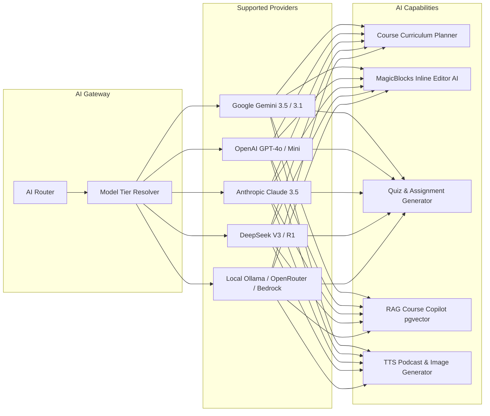
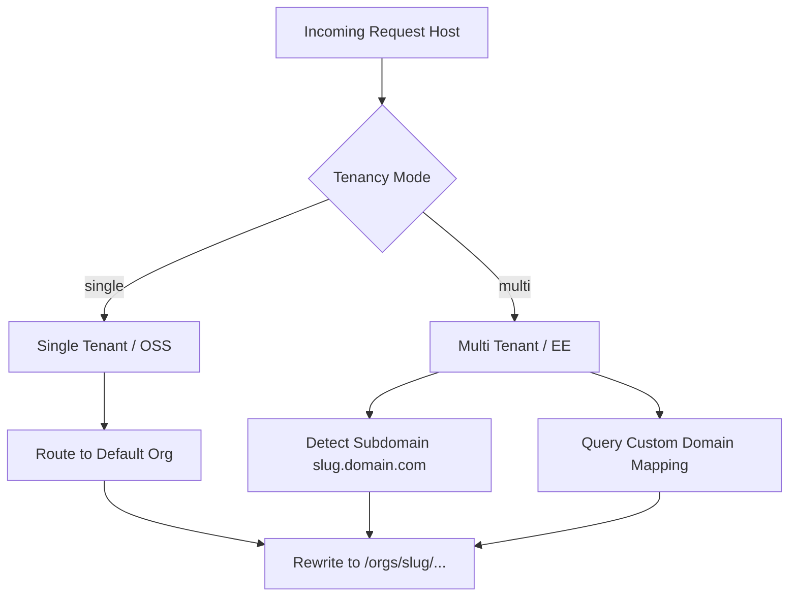

# LearnHouse: Comprehensive Architectural Deep Dive & Feature Analysis

> **Document Version:** 1.0  
> **Target System:** LearnHouse (Next-Gen Open-Source Learning Platform)  
> **Source Repository:** `D:\learnhouse`  
> **Scope:** Architecture, Backend Engine, Frontend Experience, Real-Time Collaboration, AI Subsystem, Database Schema, and Feature Matrix.

---

## Table of Contents
1. [Executive Summary & System Vision](#1-executive-summary--system-vision)
2. [High-Level System Architecture](#2-high-level-system-architecture)
   - 2.1 Monorepo Structure & Application Roles
   - 2.2 End-to-End Request & Data Flow
   - 2.3 Tenancy & Deployment Modes (OSS, EE, SaaS)
3. [Backend Deep Dive (`apps/api`)](#3-backend-deep-dive-appsapi)
   - 3.1 Tech Stack & Core Infrastructure
   - 3.2 Authentication, MFA & Security Subsystem
   - 3.3 Course & Content Authoring Engine
   - 3.4 Assignment, Auto-Grading & Judge0 Sandbox
   - 3.5 Generative AI & Vector RAG Copilot Engine
   - 3.6 Real-Time Collaboration & Whiteboard Subsystem
   - 3.7 Community, Discussions & Social Learning
   - 3.8 Audio, Podcasts & Media Streaming
   - 3.9 Certification & Credentialing Pipeline
   - 3.10 Learning Trails & User Progress Tracking
   - 3.11 Analytics, Audit Dossier & Compliance Tracking
   - 3.12 Webhooks, Integrations & API Token System
   - 3.13 Lifecycle Email Automations (Nudges)
4. [Frontend Deep Dive (`apps/web`)](#4-frontend-deep-dive-appsweb)
   - 4.1 Tech Stack & Application Structure
   - 4.2 Multi-Tenant Routing & Edge Proxy Engine
   - 4.3 Block-Based Content Editor (Notion-like Tiptap 3 Suite)
   - 4.4 Course Player & Student Experience
   - 4.5 Instructor Studio & Admin Dashboard
   - 4.6 Real-Time Collaborative Canvas (Boards)
   - 4.7 Multi-Language Code Playground & Evaluation UI
   - 4.8 Responsive Design, Theming & White-Labeling
5. [Real-Time Collaboration Engine (`apps/collab`)](#5-real-time-collaboration-engine-appscollab)
6. [CLI & DevOps Ecosystem (`apps/cli` & Docker)](#6-cli--devops-ecosystem-appscli--docker)
7. [Comprehensive Feature Matrix (Frontend vs Backend)](#7-comprehensive-feature-matrix-frontend-vs-backend)
8. [Data Model & Database Entity Relationships](#8-data-model--database-entity-relationships)
9. [Key Architectural Strengths & Engineering Insights](#9-key-architectural-strengths--engineering-insights)

---

## 1. Executive Summary & System Vision

**LearnHouse** is a state-of-the-art, open-source educational platform designed to provide a modern, frictionless learning and content creation experience. Unlike legacy LMS (Learning Management System) architectures like Moodle or Canvas, LearnHouse is built around modern web standards, featuring:

- **Notion-like rich-block authoring** with real-time multiplayer editing (Yjs / CRDTs).
- **Embedded code execution and automated grading** in 30+ programming languages via isolated sandboxes (Judge0).
- **Multi-provider Generative AI** (Gemini, Claude, GPT, DeepSeek, Ollama) for curriculum generation, inline writing assistance (MagicBlocks), automated quiz/scenario generation, and course-grounded RAG (pgvector) copilot.
- **Real-time collaborative whiteboards** for interactive teaching.
- **Audio-first learning** with built-in podcast feeds, synchronized waveform players, and transcripts.
- **Enterprise-ready multi-tenancy**, custom domains, SCORM 1.2/2004 support, Stripe monetization, and legally-defensible student activity audit trails.

```
+-----------------------------------------------------------------------------------+
|                                   LEARNHOUSE                                      |
+-----------------------------------------------------------------------------------+
|  [apps/web]           |  [apps/collab]        |  [apps/api]         |  [apps/cli]  |
|  Next.js 16 / React 19|  Hocuspocus + Yjs     |  FastAPI + Python   |  Commander   |
|  TailwindCSS 4        |  WebSockets Sync      |  SQLModel + Alembic |  Dev / Ops   |
|  Tiptap 3 Editor      |  Redis State Cache    |  PostgreSQL / pgvec |  Management  |
+-----------------------------------------------------------------------------------+
```

---

## 2. High-Level System Architecture

### 2.1 Monorepo Structure & Application Roles

```
D:\learnhouse\
├── apps\
│   ├── web\             # Next.js 16 frontend (App Router, Turbopack, Tiptap, Radix UI)
│   ├── api\             # FastAPI Python backend (SQLModel, PostgreSQL, Redis, AI)
│   ├── collab\          # Hocuspocus Yjs WebSocket server for real-time multiplayer
│   ├── cli\             # Official LearnHouse CLI (instance management, backups, dev)
│   └── e2e\             # End-to-End integration test suite
├── docker\              # Docker Compose definitions (PostgreSQL, Redis, Judge0, API, Web)
├── scripts\             # Setup and migration scripts
└── docs\                # Documentation
```

| Application | Technology Stack | Primary Responsibilities |
|---|---|---|
| **Web (`apps/web`)** | Next.js 16 (React 19), TailwindCSS 4, Radix UI, Tiptap 3, CodeMirror 6, TanStack Query | Course player, Notion-like block editor, Whiteboards, Instructor Studio, Analytics dashboard, Tenant router proxy. |
| **API (`apps/api`)** | FastAPI, Python 3.11+, SQLModel / SQLAlchemy 2, Alembic, Pydantic AI, pgvector | Core REST API, RBAC, Data persistence, AI orchestration, Code grading via Judge0, Webhooks, MFA, Nudges. |
| **Collab (`apps/collab`)** | Node.js, `@hocuspocus/server`, Yjs CRDTs, Redis, WebSockets | Multiplayer synchronization for document editing and collaborative whiteboards with debounced database persistence. |
| **CLI (`apps/cli`)** | Node.js, Commander.js, Vitest, tsup | Developer setup (`npx learnhouse dev`), instance lifecycle (`start`, `stop`, `update`, `backup`, `doctor`). |

### 2.2 End-to-End Request & Data Flow

```mermaid
flowchart TD
    Client[Browser / Learner / Instructor]
    NextProxy[Next.js Edge Proxy / Middleware proxy.ts]
    NextApp[Next.js App Router (React Server/Client Components)]
    CollabServer[Collab Server (Hocuspocus Yjs WS :4000)]
    FastAPI[FastAPI Backend (:1338 / :8000)]
    Postgres[(PostgreSQL + pgvector)]
    Redis[(Redis DB - Caching, PubSub & Yjs Buffers)]
    Judge0[Judge0 Sandbox (Code Execution)]
    LLM[AI Providers: Gemini / OpenAI / Claude / Ollama]
    Storage[Storage: Local Filesystem / AWS S3 API]
    Tinybird[Tinybird / ClickHouse Real-Time Analytics]

    Client -->|HTTP/HTTPS| NextProxy
    NextProxy -->|Dynamic Subdomain/Custom Domain Route| NextApp
    Client -->|WebSocket| CollabServer
    CollabServer <-->|Buffer & Sync| Redis
    CollabServer -->|Debounced Save HTTP| FastAPI
    NextApp -->|REST API Requests| FastAPI
    FastAPI <-->|SQL Queries & Embeddings| Postgres
    FastAPI <-->|Rate Limit / Cache / Tokens| Redis
    FastAPI -->|Submit Code & Grade| Judge0
    FastAPI -->|Prompt & Stream SSE| LLM
    FastAPI -->|Media & Document IO| Storage
    FastAPI -->|Event Ingest & Query| Tinybird
```

### 2.3 Tenancy & Deployment Modes (OSS, EE, SaaS)

LearnHouse is architected around 3 deployment flavors:

1. **OSS (Open Source Software - Single Tenant):**
   - Runs locally or on a single VPS.
   - All traffic routes to the default organization (`default`).
   - Host-only session cookies.
2. **EE (Enterprise Edition - Multi-Tenant):**
   - Multi-tenant organization routing via subdomains (`tenant.domain.com`) or verified custom domains (`learn.company.com`).
   - Enterprise features activated: SCORM 1.2/2004 engine, Stripe Connect direct payouts, SSO, organization-level MFA policies.
3. **SaaS (Cloud Hosted):**
   - Cloud multi-tenant with platform metering, AI credit consumption packs, and automatic tier gating.

---

## 3. Backend Deep Dive (`apps/api`)

### 3.1 Tech Stack & Core Infrastructure
- **Framework:** FastAPI (asynchronous ASGI framework).
- **ORM & Validation:** SQLModel (unifying SQLAlchemy 2.0 async and Pydantic v2).
- **Database Migrations:** Alembic with auto-generating revision history.
- **Database Engine:** PostgreSQL with `pgvector` extension for vector similarity search.
- **Cache & Session Layer:** Redis (sessions, token revocation lists, rate limits, analytics caches).
- **Storage Subsystem:** Pluggable storage abstraction supporting **Local Filesystem** and **AWS S3 / S3-compatible APIs** (MinIO, Cloudflare R2).

---

### 3.2 Authentication, MFA & Security Subsystem

```
+-----------------------------------------------------------------------+
|                       AUTHENTICATION PIPELINE                         |
+-----------------------------------------------------------------------+
|  1. Login Request (Email/Password or Google OAuth)                    |
|  2. Account Lockout Check (exponential backoff on repeated failures)  |
|  3. Rate Limiting Check (IP + Account buckets via Redis)              |
|  4. MFA Enforcement Check (TOTP Required?)                            |
|     ├── If Enabled -> Return MFA Pending Token + Challenge            |
|     └── If Disabled/Verified -> Issue JWT Access + Rolling Refresh    |
|  5. RBAC & Org Membership Resolution                                  |
+-----------------------------------------------------------------------+
```

- **JWT Session Architecture:**
  - Short-lived HTTP-only Access Tokens + Rolling Refresh Tokens.
  - Token revocation tracking in Redis with instantaneous logout support.
  - Tenancy-aware cookie domains (wildcard for multi-tenant, host-only for single).
- **Two-Factor Authentication (MFA / 2FA):**
  - Standard RFC 6238 TOTP with QR code provisioning and encrypted database storage.
  - One-time emergency backup codes (hashed and tracked per usage).
  - Organization-enforced MFA policies (mandatory 2FA for staff or learners).
- **Security Defenses:**
  - Anti-brute force account lockout with dynamic lockout duration.
  - CSRF token validation and strictly scoped CORS origin regex matching.
  - API Token authentication for headless integration and programmatic access.
  - Fine-grained RBAC permissions verifying resource ownership, organization boundary, and role entitlements.

---

### 3.3 Course & Content Authoring Engine

The core domain model structures educational content into a 3-level hierarchy:

$$\text{Course} \longrightarrow \text{Chapters} \longrightarrow \text{Activities}$$

#### Activity Types & Sub-Types:
1. **Dynamic Page (`TYPE_DYNAMIC`):**
   - `SUBTYPE_DYNAMIC_PAGE`: Rich-block interactive document powered by Tiptap.
   - `SUBTYPE_DYNAMIC_MARKDOWN`: Raw Markdown rendering with GitHub flavor & KaTeX.
   - `SUBTYPE_DYNAMIC_EMBED`: External interactive embeds (Figma, Codepen, Google Docs, etc.).
   - `SUBTYPE_DYNAMIC_RESOURCE`: File attachments and downloadable resources.
2. **Video (`TYPE_VIDEO`):**
   - `SUBTYPE_VIDEO_YOUTUBE`: Embedded YouTube player with tracking.
   - `SUBTYPE_VIDEO_HOSTED`: Native HTML5/HLS video streaming from local/S3 storage with Video.js, quality switching, and resume position tracking.
3. **Document (`TYPE_DOCUMENT`):**
   - `SUBTYPE_DOCUMENT_PDF`: In-browser PDF reader with zoom, page navigation, and text search.
   - `SUBTYPE_DOCUMENT_DOC`: Office document viewer.
4. **Assignment (`TYPE_ASSIGNMENT`):**
   - Multi-task assessments and auto-grading.
5. **Collaborative Boards & Playgrounds (`TYPE_CUSTOM`):**
   - Interactive whiteboards and code sandboxes.
6. **SCORM Package (`TYPE_SCORM` - Enterprise):**
   - `SUBTYPE_SCORM_12` & `SUBTYPE_SCORM_2004`: Complete SCORM player runtime with CMI state tracking, score reporting, and completion commit hooks.

#### Content Versioning & Activity Locks:
- **Snapshot Version Control:** Every activity mutation creates immutable version snapshots (`activity_versions`), allowing authors to inspect history and roll back instantly.
- **Granular Lock Types:**
  - `PUBLIC`: Accessible to unauthenticated public visitors.
  - `AUTHENTICATED`: Requires an active account.
  - `RESTRICTED`: Scoped strictly to specific **User Groups** (e.g., Cohort A, Premium Tier).

---

### 3.4 Assignment, Auto-Grading & Judge0 Sandbox

```
+------------------------------------------------------------------------+
|                          ASSIGNMENT ENGINE                             |
+------------------------------------------------------------------------+
|  Task Types:                                                           |
|  - CODE: Source code tested against hidden/visible test cases (Judge0) |
|  - QUIZ: Single/Multiple choice with auto-scoring                      |
|  - FORM / SHORT ANSWER / NUMBER: Typed input validation                |
|  - FILE SUBMISSION: File uploads for manual instructor evaluation      |
|  - CUSTOM: Arbitrary JSON schema for headless LMS frontends            |
|                                                                        |
|  Grading Schemes:                                                      |
|  - PERCENTAGE (0-100%) | NUMERIC | PASS/FAIL | ALPHABET (A-F) | GPA    |
|                                                                        |
|  Integrity Features:                                                   |
|  - Anti-Copy/Paste clipboard deterrence                                |
|  - Bounded attempt limits (Max Retries)                                |
|  - Answer key reveal controls post-grading                             |
+------------------------------------------------------------------------+
```

#### Code Execution Sandbox (Judge0):
- Executes submitted code across **30+ languages** (Python, JavaScript, TypeScript, C++, Rust, Go, Java, PHP, SQL, etc.).
- **Batch Evaluation:** Concurrently executes submissions against an array of test cases (`stdin` vs `expected_stdout`) with timeout (30s) and memory constraints.
- **SQL Execution Engine:** Safely wraps raw SQL into isolated in-memory or SQLite database files with base64 parameter injection prevention.

---

### 3.5 Generative AI & Vector RAG Copilot Engine

LearnHouse features an advanced, multi-provider AI ecosystem orchestrated via **Pydantic AI**:



1. **Three-Tier AI Model Architecture:**
   - **Fast Tier:** Fast execution for titles, follow-up suggestions, translations (`gemini-3.1-flash-lite` / `gpt-4o-mini`).
   - **Standard Tier:** General chat, RAG retrieval, and standard course planning (`gemini-3.5-flash` / `gpt-4o`).
   - **Pro Tier:** Complex curriculum synthesis, deep problem generation, and multi-step reasoning (`gemini-3.1-pro-preview` / `claude-3-5-sonnet`).
2. **Course Planning Engine:** Conversational SSE streaming session that interacts with educators to scaffold complete courses (structure, chapters, learning objectives, and initial activity drafts).
3. **MagicBlocks:** AI-powered writing companion integrated directly inside the Tiptap editor:
   - Summarize, expand, translate, adjust tone, simplify concepts, and generate custom text blocks.
4. **Vector RAG Course Copilot:**
   - Content extraction pipeline chunks markdown, activity text, and transcripts.
   - Generates embeddings stored in PostgreSQL with `pgvector`.
   - Conversational AI retrieves semantic context chunks and streams grounded answers with source citations back to learners.
5. **Multimodal Media Generation:**
   - Text-to-Speech (TTS) for automated podcast episode generation.
   - Text-to-Image for course thumbnails and illustrations.
   - Automatic video caption extraction.

---

### 3.6 Real-Time Collaboration & Whiteboard Subsystem
- **Boards Feature:** Real-time infinite canvas collaborative whiteboards.
- **CRDT Synchronization:** Uses Yjs binary state vectors routed through the `apps/collab` WebSocket gateway.
- **Persistence Pipeline:** Changes buffered in memory and Redis, then asynchronously debounced and committed back to the PostgreSQL database as binary snapshots.
- **Interactive Board Playgrounds:** Reusable whiteboard templates embedded into activities for interactive demonstrations.

---

### 3.7 Community, Discussions & Social Learning
- Structured community forums organized by channels/topics or tied directly to individual courses.
- **Threaded Discussions & Comments:** Nested discussions with rich formatting.
- **Social Engagement:** Upvoting/downvoting mechanics, emoji reactions, pinned discussions, and thread locking for moderation.

---

### 3.8 Audio, Podcasts & Media Streaming
- **Podcasts Subsystem:** Dedicated audio channels with serialized episodes.
- **Custom Waveform Visualizer:** Audio rendered using WaveSurfer.js with chapter markers and real-time playback control.
- **AI Podcast Generation:** Generates podcast dialogues from written course material using neural TTS.

---

### 3.9 Certification & Credentialing Pipeline
- Automatic certificate issuance triggered once a learner meets course completion criteria and passes gating assignments.
- **Dynamic Certificate Engine:** HTML5 Canvas / PDF rendering with organization branding, student name, completion timestamp, and QR verification code.
- **Verifiable Credentials:** Public verification URLs (`/certificates/verify/{uuid}`) allowing employers/institutions to validate certificate authenticity.
- **Revocation Pipeline:** Automatically revokes certificates if a prerequisite assignment is re-graded or reset.

---

### 3.10 Learning Trails & User Progress Tracking
- **Trail System:** Tracks a learner's sequential journey through courses and activities.
- Calculates real-time progress percentages per chapter and course.
- Remembers resume position (last visited activity, video timestamp, and completed blocks).

---

### 3.11 Analytics, Audit Dossier & Compliance Tracking
- **High-Throughput Analytics Engine:** Direct integration with **Tinybird (ClickHouse)** or PostgreSQL event logs for ultra-fast time-series analytics.
- **Metrics Tracked:** Active learners, course enrollments, completion rates, dropout hotspots, assignment grade distributions, and revenue cohorts.
- **Student Audit Dossier:** Comprehensive compliance feature generating legally defensible audit logs for enterprise accreditation:
  - Exact activity open timestamps, IP addresses, submission attempts, grade overrides, and certificate issuance events.
  - One-click CSV export.

---

### 3.12 Webhooks, Integrations & API Token System
- **Webhook Event Hub:** Subscribes external systems to **30+ lifecycle events** (Course completed, Assignment submitted, User enrolled, Grade assigned, Certificate claimed, etc.).
- **Security:** HMAC SHA256 signature verification headers (`X-LearnHouse-Signature`), exponential backoff retries, delivery failure logs, and manual test dispatch.
- **Integrations:** Native Zapier app connector.
- **Scoped API Tokens:** Granular tokens for headless LMS integrations and CI/CD content publishing.

---

### 3.13 Lifecycle Email Automations (Nudges)
- **Nudge Engine:** Scheduled background worker that detects student milestones (abandoned courses, upcoming assignment deadlines, achievement celebrations).
- **Email Delivery:** Integrations with **Resend** and standard **SMTP**.
- **HMAC Unsubscribe Protection:** Cryptographically signed one-click unsubscribe links requiring no login to opt out.

---

## 4. Frontend Deep Dive (`apps/web`)

### 4.1 Tech Stack & Application Structure
- **Framework:** Next.js 16 with React 19 (App Router, Turbopack, React Server Components).
- **Styling & UI Kit:** TailwindCSS 4, Radix UI primitives (Dialog, DropdownMenu, Tabs, Popover, Tooltip, Switch, Toggle), Lucide Icons, Phosphor Icons.
- **State Management & Caching:** TanStack React Query v5 (client server-state cache), SWR, custom React Contexts.
- **Form Management:** Formik with Yup validation schemas.
- **Visualization & Media:** Recharts (analytics graphs), WaveSurfer.js (audio waveforms), Video.js, KaTeX (math rendering), Emblor (tagging), Canvas-Confetti.
- **Internationalization:** `i18next` with browser language detection.

---

### 4.2 Multi-Tenant Routing & Edge Proxy Engine (`proxy.ts`)

The Next.js proxy middleware transparently routes requests based on domain structure:



---

### 4.3 Block-Based Content Editor (Notion-like Tiptap 3 Suite)

The editor is one of LearnHouse's signature features. Built on top of Tiptap 3 (ProseMirror), it features **23+ bespoke extensions**:

| Extension | Functional Capabilities |
|---|---|
| **AIStreaming & MagicBlocks** | Real-time token streaming inside editor blocks for AI generation and rewriting. |
| **CodePlayground** | Interactive CodeMirror 6 block with multi-language execution and console output. |
| **Quiz Block** | Embedded interactive quizzes with multiple-choice validation. |
| **MathEquation** | LaTeX math formula editor and renderer powered by KaTeX. |
| **Flipcard** | Interactive flashcards for spaced repetition and self-testing. |
| **Scenarios** | Branching interactive scenario simulations. |
| **Callout & Badges** | Styled alert boxes, admonitions, and status badges. |
| **SlashCommands (`/`)** | Notion-like popover menu for rapid block insertion. |
| **DragHandle** | Block reordering and dragging handles. |
| **Video & Audio** | Native player embeds with custom controls and WaveSurfer integration. |
| **PDF & Library** | Embedded PDF document viewer and digital asset library picker. |
| **EmbedObjects & WebPreview**| Live previews and iframes for external web resources. |
| **Collaboration & Caret** | Live multiplayer cursor carets showing remote users editing simultaneously. |

---

### 4.4 Course Player & Student Experience
- **Distraction-Free Course Player:** Full-screen responsive layout with collapsible chapter navigation sidebar.
- **Live Progress Synchronization:** Automatically marks activities complete, updates trail progress, and saves video timestamps.
- **Interactive Copilot Modal:** Floating AI tutor providing contextual explanations grounded in the current lesson.
- **Student Gradebook & Assignment Submissions:** File uploader, anti-cheat code editor, immediate auto-grade feedback, and submission retry workflows.

---

### 4.5 Instructor Studio & Admin Dashboard
- **Course Builder:** Drag-and-drop course curriculum builder with chapter organization and activity management.
- **Assignment Gradebook:** Centralized grading queue showing pending student submissions, automated test results, rubric scoring, and feedback inputs.
- **White-Label Customization:** Live preview editor for organization branding, logos, color themes, landing page hero sections, and custom navigation links.
- **User & Cohort Management:** Learner directory, role assignments (Admin, Teacher, Student), and User Group cohort allocation.
- **Analytics Visualizer:** Visual dashboards for enrollments, engagement heatmaps, completion rates, and student audit reports.

---

### 4.6 Real-Time Collaborative Canvas (Boards)
- Infinite canvas whiteboard powered by Yjs.
- Shape drawing, freehand pen/pencil, sticky notes, connectors, image uploads, and text toolkits.
- Live participant presence indicator with real-time cursor tracking.

---

### 4.7 Multi-Language Code Playground & Evaluation UI
- Code editor powered by **CodeMirror 6** with Tokyo Night theme.
- Autocomplete, syntax highlighting, bracket matching, and linting for Python, JavaScript, TypeScript, C++, Rust, Go, Java, PHP, SQL, XML, and Markdown.
- Split-screen execution console showing standard output, standard error, execution duration, and test case pass/fail statuses.

---

## 5. Real-Time Collaboration Engine (`apps/collab`)

The collaboration server provides zero-conflict multiplayer synchronization:

- **Server Core:** `@hocuspocus/server` built on WebSockets.
- **CRDT Engine:** Yjs (Y.Doc) data structures representing document abstract syntax trees and whiteboard vector graphs.
- **Authentication:** Validates JWT access tokens on WebSocket connection handshake (`onAuthenticate`).
- **Redis State Caching:** High-speed in-memory buffer storing active Y.Doc binary states with 1-hour TTL.
- **Debounced Database Persistence:** Debounces document edits (5000ms delay) and flushes compressed Y.Doc updates via internal authenticated API calls to `apps/api`.
- **Security & Rate Limiting:** IP connection throttling (max 30 connections/min/IP) and origin verification.

---

## 6. CLI & DevOps Ecosystem (`apps/cli` & Docker)

The official LearnHouse CLI (`learnhouse`) provides a streamlined administrative interface:

```bash
# Instance Lifecycle Commands
npx learnhouse setup      # Interactive CLI setup wizard (Domain, DB, Redis, Admin user)
npx learnhouse dev        # Orchestrates local PostgreSQL, Redis, API, Web, and Collab
npx learnhouse start      # Launches production containerized services
npx learnhouse stop       # Gracefully halts running instance containers
npx learnhouse update     # Pulls latest releases and runs database migrations
npx learnhouse backup     # Creates encrypted database and media asset snapshots
npx learnhouse doctor     # Self-diagnostics (checks ports, DB connections, Redis, AI keys)
npx learnhouse logs       # Unified real-time log streaming across all microservices
```

#### Production Docker Stack:
- Multi-stage Dockerfiles for `apps/web` (Node/Next.js standalone), `apps/api` (Python uv/FastAPI), and `apps/collab` (Node/Hocuspocus).
- Docker Compose recipes for single-command production deployment with automatic health checks.

---

## 7. Comprehensive Feature Matrix (Frontend vs Backend)

| Domain | Frontend Capability (`apps/web`) | Backend Capability (`apps/api`) |
|---|---|---|
| **Authentication** | Login, Registration, Google SSO button, MFA TOTP QR modal, Backup code prompt, Session expiry warning | JWT minting, Rolling refresh cookies, RFC 6238 TOTP verification, Account lockout, Rate limiting |
| **Course Authoring** | Drag-and-drop course builder, Chapter reordering, Thumbnail image/video uploader, SEO metadata editor | Course CRUD, Chapter reordering, Activity cascade delete, Contributor RBAC, SEO JSON schema storage |
| **Rich Text Editor** | Tiptap 3 block editor, Slash menu (`/`), Drag handles, LaTeX KaTeX, CodeMirror 6, Image/PDF uploader | Activity JSON schema validation, Version snapshot creation, Diff rollback, Media asset pipeline |
| **Video Player** | Video.js player, HLS stream switcher, YouTube wrapper, Playback speed & position resume | S3 / Local chunked video streaming (`/stream`), Video metadata extraction, YouTube parser |
| **Assignments** | Task builder (Code, Quiz, Form, Short Answer, File), Student submission interface, Anti-paste guard | Task evaluation engine, Judge0 batch test-case runner, Scoring algorithms (5 grading schemes), Retry logic |
| **Certifications** | Certificate claim confetti view, PDF generator, Public verification landing page | Automatic completion triggers, Certificate UUID registry, Verification API, Revocation hooks |
| **AI Copilot & RAG** | Floating chat copilot, Markdown & source citation renderer, Prompt suggestion pills | pgvector similarity search, Content chunking & embedding pipeline, Multi-provider streaming SSE |
| **AI Content Studio** | Course planning chat interface, MagicBlocks inline prompt menu, AI Quiz generator modal | Pydantic AI orchestration (Gemini, OpenAI, Claude, DeepSeek, Ollama), 3-tier model resolver |
| **Whiteboards** | Infinite canvas drawing board, Multi-user live cursor carets, Sticky notes, Shape tools | Yjs binary document persistence, Room access control, Snapshot storage |
| **Podcasts** | Serialized episode list, WaveSurfer.js audio visualizer, Episode transcript sync | Podcast RSS/JSON feeds, Audio file streaming, Neural TTS audio generation pipeline |
| **Community Forums** | Channel discussions, Threaded comments, Upvoting/Downvoting, Emoji reactions, Pin/Lock badges | Discussion CRUD, Moderation guards, Comment voting tallies, Notification dispatch |
| **Analytics & Audit** | Recharts visual graphs (DAU, completion rates, dropout hotspots), Student Dossier table | Tinybird / Postgres event ingestion, Aggregate SQL queries, Compliance audit trail generator |
| **Webhooks & APIs** | Webhook endpoint manager, Event selector (30+ events), Delivery log inspector, Test event button | HMAC SHA256 signature generator, Dispatch queue with retry backoff, Scoped API token validation |
| **Multi-Tenancy** | Domain detection proxy (`proxy.ts`), Custom domain branding, Tenant switch dropdown | Subdomain & custom domain resolution, Database tenant isolation, Multi-tenant cookie domains |
| **Nudges & Email** | Opt-out preference UI, Email template preview | Automated cron schedule, Milestone evaluation, Resend/SMTP dispatcher, HMAC unsubscribe |

---

## 8. Data Model & Database Entity Relationships

```
+-------------------+       1:N       +-------------------+       1:N       +-------------------+
|   Organization    | --------------< |      Course       | --------------< |      Chapter      |
+-------------------+                 +-------------------+                 +-------------------+
  |               |                     |               |                     |
  | 1:N           | 1:N                 | 1:N           | 1:N                 | 1:N
  v               v                     v               v                     v
+-----------+   +-------------+       +-----------+   +-------------+       +-------------------+
|   User    |   | CustomDomain|       |Assignment |   |Certificate  |       |     Activity      |
+-----------+   +-------------+       +-----------+   +-------------+       +-------------------+
  |       |                             |                                     |           |
  | 1:N   | 1:N                         | 1:N                                 | 1:N       | 1:N
  v       v                             v                                     v           v
+-----------+   +-------------+       +-------------------+                 +-------+   +-------+
| UserGroup |   | AuditEvents |       |  AssignmentTask   |                 |Version|   |Progress
+-----------+   +-------------+       +-------------------+                 +-------+   +-------+
                                        |
                                        | 1:N
                                        v
                                      +-------------------+
                                      |  TaskSubmission   |
                                      +-------------------+
```

---

## 9. Key Architectural Strengths & Engineering Insights

1. **True Modern Content Architecture:** By rejecting legacy iframe/HTML WYSIWYG editors in favor of a structured **Tiptap 3 JSON AST** paired with **Yjs CRDTs**, LearnHouse achieves Google Docs-level multiplayer collaboration across both rich documents and whiteboards.
2. **Provider-Agnostic AI Tiering:** Rather than hardcoding a single AI vendor, LearnHouse's multi-tier abstraction allows self-hosters to use free local models (Ollama) while enterprises can use Claude 3.5 Sonnet or Gemini 3.5 Pro for mission-critical curriculum generation.
3. **Pluggable Multi-Tenant Edge:** Next.js Edge proxying cleanly isolates multi-tenant complexity from business logic—single-tenant open-source deployments run zero overhead, while enterprise clusters automatically support custom domains and subdomains.
4. **Legally-Defensible Audit Trail:** The Student Dossier feature bridges the gap between modern UX and enterprise compliance requirements, making LearnHouse suitable for accredited academic institutions and regulated enterprise training.
5. **Turnkey Self-Hosting Experience:** The dedicated Node.js CLI with built-in doctor diagnostics, automated migrations, and Docker orchestration significantly lowers the barrier to entry for self-hosters.
