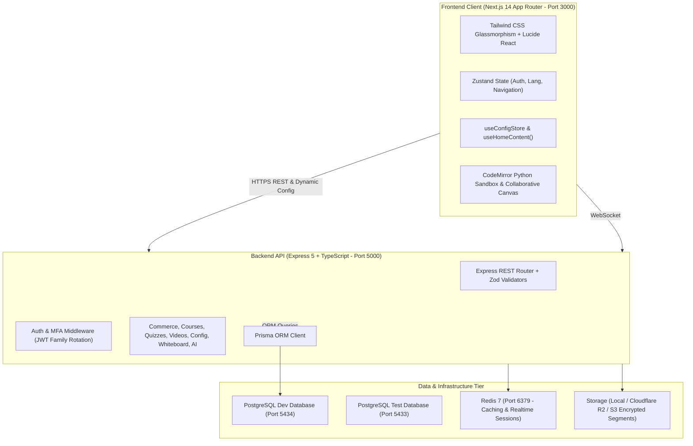

# 🎓 EduPlatform — Enterprise Next-Gen Educational & E-Learning Platform

[](https://github.com/Hegazian/Digital-Platform/actions)
[](LICENSE)
[](https://nextjs.org/)
[](https://nodejs.org/)
[](https://expressjs.com/)
[](https://www.postgresql.org/)
[](https://www.prisma.io/)
[](https://www.typescriptlang.org/)
[](https://tailwindcss.com/)

An enterprise-grade, paid, bilingual (**Arabic RTL / English LTR**) educational platform designed for modern digital learning. Originally architected for the Egyptian secondary school curriculum (Thanaweya Amma), **EduPlatform is fully generic and customizable for any curriculum, topic, or educational institution** via the comprehensive administrative content governance engine.

---

## 🌟 Key Highlights & Capabilities

### 🎨 Fully Configurable & Rebrandable (Generic for Any Topic)
- **Live Landing Page Content Editor**: Administrators can customize all homepage words, headlines, value propositions, CTAs, "How It Works" steps, teacher recruitment banners, and footer copy in real time.
- **Dynamic Topic & Specialty Badges**: Add, edit, reorder, or remove topic/curriculum badges (e.g. *Engineering*, *Computer Science & AI*, *Medical Sciences*, *Languages*, *Business*) directly from the Admin Dashboard.
- **Dynamic Bilingual Identity**: Full RTL/LTR internationalization (Arabic *Tajawal* & English *Inter*) with customizable platform slogans, marketing descriptions, accent themes, and SEO meta tags.
- **Multi-Currency Pricing**: Native support for **EGP**, **USD**, and **SAR** with automated exchange rate conversion and single source-of-truth pricing.

### 🛡️ Enterprise Security & Auth Architecture
- **JWT Refresh Token Rotation**: Secure token families with reuse detection and instant family revocation.
- **Two-Factor Authentication (MFA / 2FA)**: Time-based One-Time Password (TOTP) setup with QR code generation, backup codes, and strict route gating.
- **Role-Based Access Control (RBAC)**: Fine-grained permissions across 4 distinct roles: `STUDENT`, `TEACHER`, `PARENT`, and `ADMIN`.
- **Developer API & Webhooks**: Scoped API token management with SHA-256 hash storage and HMAC-signed webhook event delivery.

### 📚 Learning & Course Delivery Engine
- **Hierarchical Curriculum Model**: Multi-level hierarchy supporting Stages, Grades, Terms, Subjects, Courses, Sections, and Lessons.
- **Content-Based Free Preview**: Automatic free preview access for initial course sections to drive conversions without subscription requirements.
- **AES-128 HLS Encrypted Video Streaming**: Self-hosted video delivery with on-the-fly binary decryption key distribution exclusively to authorized subscribers.
- **Interactive In-Browser Code Playground**: Isolated Python execution sandbox for programming lessons with memory and timeout enforcement.
- **Real-Time Collaborative Whiteboards**: Multiplayer drawing canvas for live problem-solving and teacher demonstrations.
- **AI Tutor Drawer**: In-context conversational AI assistant to answer student questions and explain complex lessons.
- **Assessments, Quizzes & Assignments**: Comprehensive testing suite with auto-grading, student submission workflows, teacher feedback, and deadline enforcement.
- **Parent Portal & Progress Tracking**: Family invitation linking allowing parents to monitor student watch time, attendance, quiz scores, and course progress.

### 💳 Commerce & Subscription Engine
- **Egyptian & International Payment Gateways**: Integration-ready endpoints for **Paymob**, **Fawry**, Credit/Debit Cards, and Mobile Wallets (Vodafone Cash, Orange, Etisalat, InstaPay).
- **Voucher Redemption System**: Atomic redemption of pre-paid physical or digital voucher codes with race-condition prevention.
- **Granular Entitlements**: Automatic subscription resolution per subject or course bundle with expiration scheduling.

---

## 🏗️ System Architecture



---

## 📁 Repository Structure

```
digital-platform/
├── client/                     # Next.js 14 Frontend Application
│   ├── src/
│   │   ├── app/                # App Router (Pages, Layouts, Providers)
│   │   ├── components/         # Reusable UI, Admin Panels, Modals, Player
│   │   │   ├── admin/          # Admin Dashboard (PlatformSettings, Queue, Tokens)
│   │   │   ├── editor/         # Code Playground & Collaborative Whiteboard
│   │   │   ├── teacher/        # Teacher Studio & Course Manager
│   │   │   └── ...
│   │   ├── lib/                # API client, Zustand stores, Config store
│   │   └── ...
│   └── package.json
│
├── server/                     # Express 5 + TypeScript REST API
│   ├── prisma/                 # Prisma schema, migrations, seed script
│   ├── src/
│   │   ├── modules/            # Domain modules (auth, courses, config, commerce, etc.)
│   │   ├── middleware/         # Auth, validation, rate limiting, error handling
│   │   ├── utils/              # Storage, JWT, currency, logging, webhooks
│   │   ├── app.ts              # Express application setup
│   │   └── server.ts           # Server entry point
│   ├── tests/                  # Vitest test suites (Unit, Integration, E2E)
│   └── package.json
│
├── docker-compose.yml          # Container configuration (Dev & Test Postgres, Redis)
├── Educational_Platform_System_Design_Document.md  # Complete 3000+ line system design
├── project_overview_and_usage_guide.md             # In-depth operator & usage manual
├── manual_testing_guide.md                         # Manual testing & QA verification
└── DEEP_DIVE_ANALYSIS_AND_ENHANCEMENTS.md          # Technical audit & enhancement plan
```

---

## ⚡ Quick Start Guide

### Prerequisites
- **Node.js**: v20+ LTS or Node.js v22
- **npm**: v10+
- **Docker & Docker Compose**: For local PostgreSQL and Redis containers

### 1. Clone & Set Up Containers
```bash
# Clone the repository
git clone https://github.com/Hegazian/Digital-Platform.git
cd Digital-Platform

# Start the database and caching infrastructure
docker-compose up -d
```
The Docker Compose topology exposes:
- **Dev PostgreSQL**: `localhost:5434` (Database: `eduplatform`)
- **Test PostgreSQL**: `localhost:5433` (Database: `eduplatform_test`)
- **Redis Cache**: `localhost:6379`

### 2. Configure & Start Backend Server
```bash
cd server

# Install dependencies
npm install

# Initialize environment configuration
cp .env.example .env

# Push schema to development database
npx prisma db push

# (Optional) Seed initial curriculum and admin account
npm run db:seed

# Start the development server
npm run dev
```
The backend API will start on **`http://localhost:5000`**.

### 3. Configure & Start Frontend Client
```bash
cd ../client

# Install dependencies
npm install

# Initialize environment configuration
cp .env.example .env.local

# Start the Next.js development server
npm run dev
```
The web application will open on **`http://localhost:3000`**.

---

## 🧪 Testing & Quality Assurance

The codebase maintains strict automated test coverage across all domain modules:

### Running Backend Tests
```bash
cd server

# Run complete Vitest suite (338+ tests across 67 test suites)
npm test

# Run tests in watch mode
npm run test:watch

# Run tests with coverage reporting
npm run test:coverage
```

### Running Frontend Typechecks & Production Build
```bash
cd client

# Check TypeScript types and build all pages
npm run build

# Run ESLint validation
npm run lint
```

---

## 🛠️ Administrative & Operational Guides

- **Admin Account Setup**: See [How to Set & Manage Admins](project_overview_and_usage_guide.md#4-how-to-set--manage-admins).
- **Home Page Content Customization**: Navigate to `/admin/dashboard` ➔ **Platform & Domain** ➔ **Home Page Content** tab to customize landing page copy, topic badges, and value propositions.
- **Course Review Queue**: Navigate to `/admin/dashboard` ➔ **Course Approvals** to inspect, approve, or reject teacher course submissions.
- **Manual QA Testing**: Refer to [Manual Testing Guide](manual_testing_guide.md).

---

## 📄 License

This project is licensed under the MIT License. See the [LICENSE](LICENSE) file for details.
