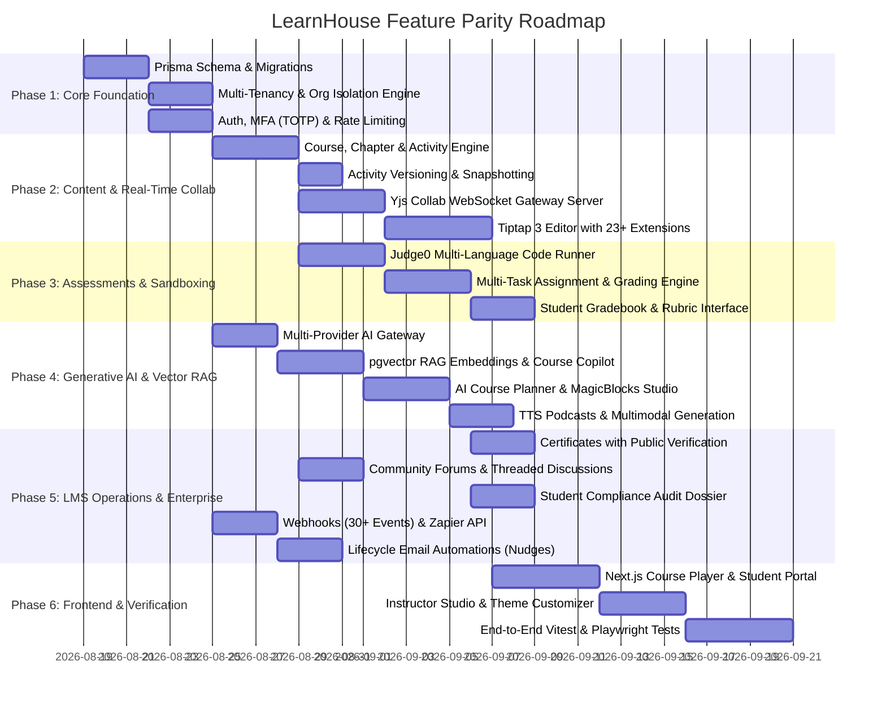

# Implementation Plan: LearnHouse Feature & Architecture Parity for Digital Platform

This implementation plan outlines the engineering roadmap to upgrade the current **Digital Platform** (`d:\digital platform`) to achieve complete feature and architectural parity with **LearnHouse** (`d:\learnhouse`), as documented in the [LearnHouse Deep Dive Analysis](file:///d:/digital%20platform/LEARNHOUSE_DEEP_DIVE_ANALYSIS.md).

---

## 1. Architectural Strategy & Target State

The current project is built on **Node.js, Express, TypeScript, Prisma ORM, and Next.js**. We will preserve and enhance this stack by implementing the clean modular patterns and microservices architecture found in LearnHouse:

```
+----------------------------------------------------------------------------------------------------+
|                                    DIGITAL PLATFORM TARGET STATE                                   |
+----------------------------------------------------------------------------------------------------+
|  [client/ (Next.js 14/15)]            |  [server/collab (Yjs WebSocket)]   |  [server/ (Express API)]      |
|  - Tiptap 3 Notion-like Suite         |  - Hocuspocus Server (:4000)        |  - Express + TypeScript       |
|  - Course Player & AI Copilot         |  - Redis Y.Doc Memory Buffer        |  - Prisma ORM + PostgreSQL    |
|  - Real-time Infinite Canvas (Board)  |  - Debounced DB Persistence         |  - Judge0 Sandbox Runner      |
|  - Instructor Studio & Gradebook      |  - Live Multiplayer Cursor Sync     |  - Multi-Provider AI Engine   |
|  - Multi-Tenant Subdomain Proxy       |                                     |  - Webhook Dispatcher (30+ ev)|
|  - WaveSurfer Audio & VideoJS Player  |                                     |  - Student Audit Dossier      |
+----------------------------------------------------------------------------------------------------+
```

---

## 2. Phase-by-Phase Implementation Roadmap



---

## 3. Detailed Component Plan & Proposed Changes

### 3.1 Database Layer (Prisma Schema Extensions)

#### [MODIFY] [`server/prisma/schema.prisma`](file:///d:/digital%20platform/server/prisma/schema.prisma)
Extend Prisma schema to support full LearnHouse entity parity:
- **Organizations & Tenancy:** `Organization`, `OrganizationConfig`, `CustomDomain`, `UserOrganization` (with roles: `SUPERADMIN`, `ORG_ADMIN`, `INSTRUCTOR`, `CONTRIBUTOR`, `STUDENT`).
- **Activity & Content System:** `Activity` with `ActivityType` (*VIDEO, DOCUMENT, DYNAMIC, ASSIGNMENT, CUSTOM, SCORM*), `ActivitySubType`, `ActivityLockType` (*PUBLIC, AUTHENTICATED, RESTRICTED*), `ActivityVersion` for immutable snapshots and rollback history.
- **Multi-Task Assignment Engine:** `Assignment` (with 5 grading types: *PERCENTAGE, NUMERIC, PASS_FAIL, ALPHABET, GPA_SCALE*, pass thresholds, retry counters, anti-copy-paste flags), `AssignmentTask` (types: *CODE, QUIZ, FORM, SHORT_ANSWER, NUMBER_ANSWER, FILE_SUBMISSION, CUSTOM*), `AssignmentTaskSubmission`.
- **Certificates & Revocation:** `Certificate` (UUID, verification code, PDF URL, criteria hash, revocation status, revoke reason).
- **Collaborative Whiteboards & Playgrounds:** `Board` (Yjs binary snapshot state, permissions, presence), `Playground` (language, boilerplate code, stdin, test cases).
- **Podcasts & Waveforms:** `Podcast`, `PodcastEpisode` (audio URL, duration, transcript JSON, waveform peaks data).
- **Community & Moderation:** `Community`, `DiscussionThread` (pinned, locked, tags), `DiscussionReply`, `DiscussionVote` (upvotes/downvotes), `DiscussionReaction` (emojis).
- **RAG & Vector Embeddings:** `CourseEmbedding` (chunk text, vector representation via pgvector extension, metadata).
- **Webhooks & API Tokens:** `WebhookEndpoint` (secret, events array, active status), `WebhookDeliveryLog` (status code, payload, response body, retry count), `ApiToken` (scopes, last used, expiration).
- **Audit Dossier:** `UserAuditEvent` (actor ID, target ID, action type, IP address, user agent, changes JSON, timestamp).
- **Nudges & Email Preferences:** `NudgeSchedule`, `UserEmailPreference` (opt-outs, HMAC unsubscribe hash).

---

### 3.2 Real-Time Collaboration Gateway (`server/collab`)

#### [NEW] `server/collab/package.json`
Dependencies: `@hocuspocus/server`, `yjs`, `ioredis`, `jsonwebtoken`, `dotenv`.

#### [NEW] `server/collab/src/index.ts`
- Standalone WebSocket server running on port `4000`.
- JWT authentication hook (`onAuthenticate`) verifying user session and organization access.
- Room isolation: `course-activity:{activityId}` and `board:{boardId}`.
- Redis state caching with 1-hour TTL.
- Debounced database persistence (flushes Y.Doc binary states to Express REST API every 5 seconds).

---

### 3.3 Backend Modules (`server/src/modules/`)

#### 1. Code Execution Sandbox Module (Judge0 Integration)
- [NEW] `server/src/modules/code/judge0.service.ts`: Client for Judge0 API supporting batch execution, timeout constraints, custom compiler options, and SQL SQLite sandbox wrappers.
- [NEW] `server/src/modules/code/code.controller.ts`: Execute single snippet, run batch test cases (`stdin` vs `expected_stdout`), and calculate test case pass percentages.
- [NEW] `server/src/modules/code/code.routes.ts`: `POST /api/v1/code/execute`, `POST /api/v1/code/execute-batch`.

#### 2. Advanced Multi-Task Assignment Module
- [NEW] `server/src/modules/assignments/assignment.service.ts`: CRUD for assignments, task orchestration, automated evaluation algorithm (aggregating task weights into grading schemes: Percentage, Numeric, Pass/Fail, Letter Grade, GPA), retry attempt tracker, and anti-cheat flag enforcement.
- [NEW] `server/src/modules/assignments/assignment.controller.ts`: Submit assignment, auto-grade tasks, manual instructor grading override, gradebook query.
- [NEW] `server/src/modules/assignments/assignment.routes.ts`: Complete assignment endpoints matching LearnHouse.

#### 3. Generative AI, RAG & Multimodal Module
- [NEW] `server/src/modules/ai/ai.provider.ts`: Multi-provider abstraction supporting Google Gemini 3.5/3.1, Anthropic Claude 3.5, OpenAI GPT-4o, DeepSeek, and local Ollama with 3-tier model resolution (*Fast, Standard, Pro*).
- [NEW] `server/src/modules/ai/course-planner.service.ts`: SSE streaming curriculum planner that converses with instructors to scaffold modules, chapters, and activities.
- [NEW] `server/src/modules/ai/magicblocks.service.ts`: Inline block AI operations (*summarize, expand, translate, adjust tone, simplify, generate code*).
- [NEW] `server/src/modules/ai/quiz-gen.service.ts`: Automated quiz, scenario, and assignment generator from lesson text.
- [NEW] `server/src/modules/ai/rag.service.ts`: Content extraction, vector embeddings generation (`pgvector`), similarity retrieval, and course-grounded conversational copilot with source citations.
- [NEW] `server/src/modules/ai/tts.service.ts`: Neural TTS generation for audio podcast episodes.
- [MODIFY] `server/src/modules/ai/ai.routes.ts`: Mount SSE streaming endpoints for planner, copilot, magicblocks, and generation tools.

#### 4. SCORM 1.2 & 2004 e-Learning Package Module
- [NEW] `server/src/modules/scorm/scorm.service.ts`: Zip extraction, `imsmanifest.xml` parser, CMI data model storage, SCORM API runtime bridge, score & completion commit handling.
- [NEW] `server/src/modules/scorm/scorm.routes.ts`: `POST /api/v1/scorm/upload`, `GET /api/v1/scorm/:id/launch`, `POST /api/v1/scorm/:id/commit`.

#### 5. Certifications & Credentialing Module
- [MODIFY] `server/src/modules/certificates/certificate.service.ts`: Automatic issuance evaluation on assignment passing, certificate verification UUID generator, revocation hooks, and PDF rendering pipeline.
- [MODIFY] `server/src/modules/certificates/certificate.routes.ts`: Add public verification endpoint `GET /api/v1/certificates/verify/:code`.

#### 6. Student Audit Dossier & Compliance Module
- [NEW] `server/src/modules/audit/dossier.service.ts`: Generates legally defensible student activity dossier (timestamps, IP addresses, assignment attempts, grade change logs, certificate issuance, session logins).
- [NEW] `server/src/modules/audit/dossier.controller.ts`: Export student audit record as JSON or CSV.
- [MODIFY] `server/src/modules/audit/audit.routes.ts`: `GET /api/v1/audit/dossier/:userId`, `GET /api/v1/audit/dossier/:userId/csv`.

#### 7. Webhook Dispatcher & Zapier Integration Module
- [NEW] `server/src/modules/developer/webhook-dispatcher.service.ts`: Event hub publishing 30+ lifecycle events (`course_completed`, `assignment_graded`, `user_enrolled`, `certificate_claimed`, etc.) with HMAC SHA256 signatures, exponential backoff retries, and delivery audit logs.
- [NEW] `server/src/modules/developer/zapier.controller.ts`: Zapier REST hook subscription endpoints.

#### 8. Lifecycle Email Nudges Module
- [NEW] `server/src/modules/nudges/nudge.service.ts`: Background cron worker evaluating student milestones (inactive 7 days, incomplete assignment, course finished), generating personalized emails via Resend/SMTP with HMAC one-click unsubscribe URLs.
- [NEW] `server/src/modules/nudges/nudge.routes.ts`: `GET /api/v1/emails/unsubscribe`, `POST /api/v1/emails/unsubscribe`.

---

### 3.4 Frontend Upgrade (`client/`)

#### 1. Rich Text Block Editor (Tiptap 3 Suite with 23+ Extensions)
- [MODIFY] `client/package.json`: Add `@tiptap/core`, `@tiptap/react`, `@tiptap/starter-kit`, `@tiptap/extension-collaboration`, `@tiptap/extension-collaboration-caret`, `@tiptap/extension-table`, `yjs`, `y-prosemirror`, `katex`, `wavesurfer.js`, `video.js`.
- [NEW] `client/src/components/editor/TiptapEditor.tsx`: Main editor wrapper with collaboration and autosave.
- [NEW] `client/src/components/editor/extensions/`:
  - `AIStreamingBlock.tsx`: Real-time streaming token renderer.
  - `MagicBlocksMenu.tsx`: Inline AI prompt popover.
  - `CodePlaygroundBlock.tsx`: Embedded CodeMirror 6 with live execution and console.
  - `QuizBlock.tsx`: Embedded interactive self-assessment quiz.
  - `MathEquationBlock.tsx`: KaTeX LaTeX formula editor.
  - `FlipcardBlock.tsx`: Interactive flip cards.
  - `ScenarioBlock.tsx`: Branching interactive decisions.
  - `SlashCommandMenu.tsx`: Notion-like `/` insertion menu.
  - `CalloutBlock.tsx`, `DragHandle.tsx`, `EmbedBlock.tsx`, `VideoBlock.tsx`, `PDFBlock.tsx`.

#### 2. Course Player & Student Learning Portal
- [NEW] `client/src/components/player/CoursePlayerLayout.tsx`: Responsive distraction-free layout with collapsible chapter hierarchy, video timestamp persistence, and automatic progress tick off.
- [NEW] `client/src/components/player/AICopilotModal.tsx`: Floating AI tutor modal with chat history, lesson context grounding, and source citation links.
- [NEW] `client/src/components/player/WaveSurferAudioPlayer.tsx`: Visual audio waveform player with transcript synchronization.
- [NEW] `client/src/components/player/SCORMPlayerModal.tsx`: SCORM 1.2/2004 iframe container with CMI bridge.

#### 3. Multi-Task Assignment & Gradebook UI
- [NEW] `client/src/components/assignments/StudentAssignmentView.tsx`: Task switcher (*Code Runner with test cases, Quiz, Form, Short Answer, File Upload*), anti-copy-paste deterrent, and instant score feedback.
- [NEW] `client/src/components/assignments/InstructorGradebook.tsx`: Pending submissions queue, code diff viewer, test case execution inspect, rubric scoring, and feedback input.

#### 4. Real-Time Collaborative Canvas (Boards)
- [NEW] `client/src/components/boards/CollaborativeBoard.tsx`: Infinite canvas drawing tool with shape tools, sticky notes, connectors, live multiplayer cursor presence, and Yjs synchronization via `server/collab`.

#### 5. Multi-Tenant Routing Proxy (`proxy.ts` / Next.js Middleware)
- [NEW] `client/src/middleware.ts`: Edge proxy resolving subdomains (`slug.domain.com`) and custom domains, seamlessly rewriting routes to the corresponding organization context.

---

## 4. Verification & Testing Plan

### 4.1 Automated Backend Integration Tests
- **Auth & MFA:** Test user signup, password login, TOTP enrollment, challenge verification, and invalid backup codes.
- **Judge0 Code Execution:** Test single snippet execution, timeout kill switch (5s/30s), SQLite isolation, and batch test cases grading across Python, JavaScript, and C++.
- **Assignment Engine:** Test multi-task submission, auto-grading calculations across all 5 grading schemes (Percentage, Numeric, Pass/Fail, Alphabet, GPA), and retry attempt limits.
- **RAG & AI:** Test vector chunk extraction, embedding indexing, SSE streaming responses, and MagicBlocks text transformations.
- **Collab Sync:** Test WebSocket connection handshake, Yjs update exchange between two simulated clients, and debounced database write back.
- **Webhooks & Nudges:** Test event dispatching, HMAC SHA256 header generation, delivery retry queue, and HMAC unsubscribe token verification.
- **Audit Dossier:** Test compliance dossier generation, CSV export formatting, and non-admin access rejection.

```bash
# Run backend test suite
cd server && npm run test
```

### 4.2 Frontend & End-to-End Tests (Playwright)
- **Course Authoring Flow:** Create course -> add chapter -> create activity with Tiptap editor -> insert CodePlayground and Math block -> save version snapshot.
- **Student Learning Flow:** Enroll in course -> watch video (progress saved) -> open AI Copilot -> submit multi-task code assignment -> view auto-graded score -> claim certificate with confetti.
- **Collaborative Board:** Open board in two browser contexts -> draw stroke in Context A -> verify real-time stroke and cursor reflection in Context B.

```bash
# Run Playwright E2E tests
cd client && npx playwright test
```

---

## 5. User Review & Decision Points

> [!IMPORTANT]
> **Judge0 Sandbox Provider:** We can connect to an external hosted Judge0 instance (e.g. RapidAPI / Self-hosted Judge0 CE) or run Judge0 locally via Docker Compose.
> 
> **AI Provider Keys:** The multi-provider gateway will default to Google Gemini (`GEMINI_API_KEY`), with drop-in support for OpenAI (`OPENAI_API_KEY`), Anthropic Claude (`ANTHROPIC_API_KEY`), or local Ollama without requiring code changes.

Please review this implementation plan. Once approved, we will begin implementation step by step.
