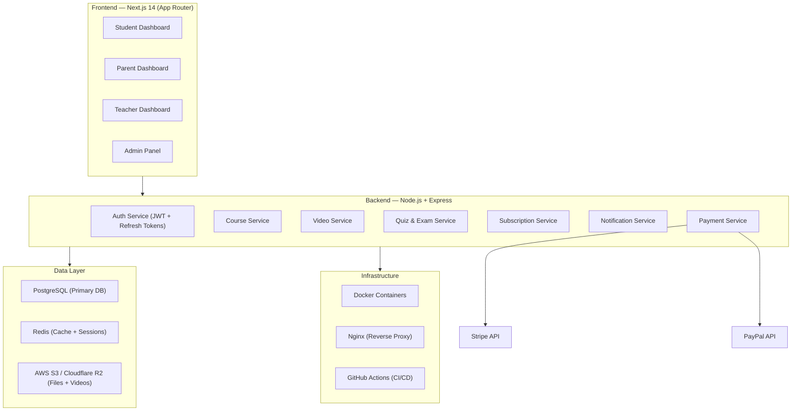
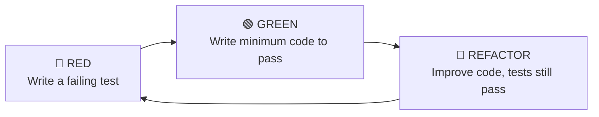
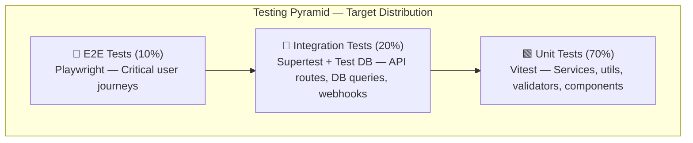
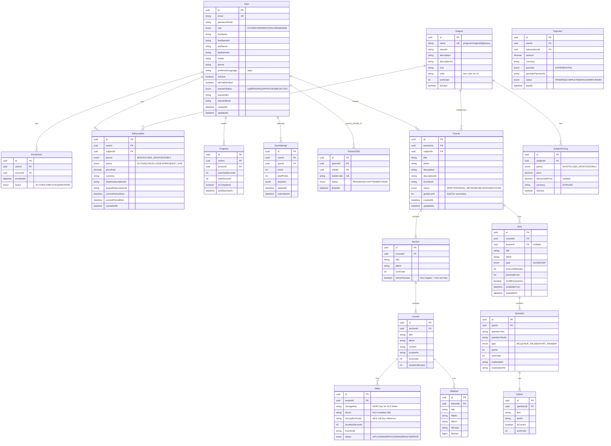
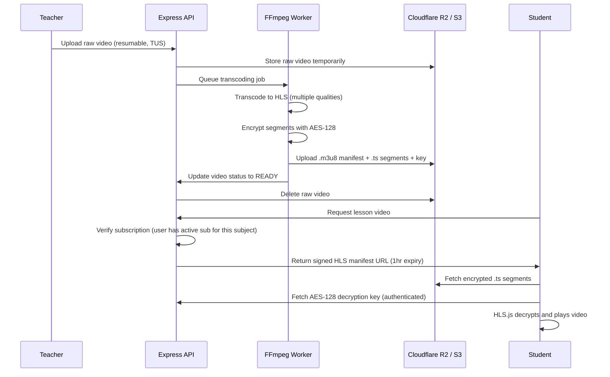
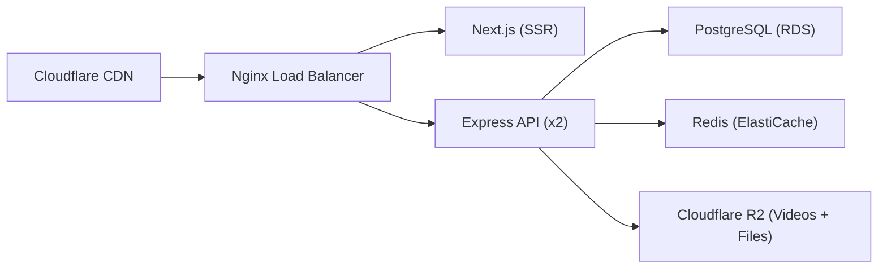

# EduPlatform — Paid Educational Digital Platform

A scalable, bilingual (Arabic/English RTL/LTR) educational platform targeting **Egyptian secondary school students and their parents**, featuring video lessons in **Programming, Math, and Physics**, with quizzes, exams, downloadable materials, per-subject subscription management, and teacher-authored courses. Aligned with the **Egyptian curriculum** but designed for worldwide use.

---

## Architecture Overview



---

## Confirmed Decisions

> [!NOTE]
> **Subscription Model — Per-Subject + Period Pricing** ✅
> Users subscribe to individual **subjects** (Programming, Math, Physics) with flexible billing periods:
> - **Monthly** — Pay per month per subject
> - **6-Month** — Discounted rate, billed every 6 months per subject
> - **Yearly** — Best value, billed annually per subject
>
> Students can subscribe to one or more subjects independently.

> [!NOTE]
> **Parent-Student Linking** ✅ — Confirmed. Parents link to children via invitation code. One parent can monitor multiple children.

> [!NOTE]
> **MVP Scope** ✅ — Confirmed.
> - **Phase 1**: Authentication, Course Management, Video Streaming, Payment/Subscriptions
> - **Phase 2**: Quizzes/Exams, Parent Dashboard, Notifications, Forums

> [!NOTE]
> **Free Trial — Content-Based** ✅ — The first chapter and introduction of each course are free (no login required to preview). This replaces a time-based trial.

> [!NOTE]
> **Teacher Onboarding** ✅ — Teachers sign up independently and submit an approval request. Admin reviews and approves/rejects.

> [!NOTE]
> **Video Security** — Self-hosted HLS with AES-128 encryption on Cloudflare R2/AWS S3 with signed URLs. This provides strong protection at minimal cost (no expensive DRM). Details in the Video Streaming section below.

> [!NOTE]
> **Target Audience** — Egyptian secondary school students (can be used worldwide). Subjects: **Programming, Math, Physics**. Curriculum: **Egyptian national curriculum**.

---

## Branding — EduPlatform

| Element | Value |
|---------|-------|
| **Primary Color** | Deep Indigo `#4338CA` — trust, education, premium feel |
| **Secondary Color** | Emerald Green `#059669` — growth, success, progress |
| **Accent Color** | Amber `#D97706` — energy, highlights, CTAs |
| **Dark BG** | Slate `#0F172A` |
| **Light BG** | Cool Gray `#F8FAFC` |
| **Arabic Font** | Tajawal (Google Fonts) |
| **English Font** | Inter (Google Fonts) |
| **Logo Concept** | Stylized graduation cap with a code bracket `</>` — merging education + tech |
| **Tagline (EN)** | "Learn Smart. Achieve More." |
| **Tagline (AR)** | "تعلّم بذكاء. حقّق المزيد." |

> [!TIP]
> All branding elements can be changed later via the admin settings panel and CSS custom properties. The design system is fully themeable.

---

## TDD Methodology — Test-Driven Development

This project follows strict **Test-Driven Development (TDD)** principles. Every feature is built using the **Red → Green → Refactor** cycle. Tests are written **BEFORE** implementation code.

### The Red → Green → Refactor Cycle



1. **🔴 RED** — Write a test that describes the expected behavior. Run it. It **must fail** (proving the feature doesn't exist yet).
2. **🟢 GREEN** — Write the **minimum** implementation code to make the test pass. No more, no less.
3. **🔵 REFACTOR** — Clean up the code (remove duplication, improve naming, optimize). Re-run all tests to ensure nothing breaks.

### Testing Pyramid



### Coverage Requirements

| Layer | Minimum Coverage | Tool |
|-------|-----------------|------|
| **Service Layer** (`*.service.ts`) | **90%** | Vitest + Istanbul |
| **Controllers** (`*.controller.ts`) | **70%** | Vitest + Supertest |
| **Validators / Utils** | **95%** | Vitest |
| **React Components** | **60%** | Vitest + Testing Library |
| **React Hooks** | **80%** | Vitest + renderHook |
| **E2E Critical Paths** | **100%** of defined journeys | Playwright |
| **Overall Project** | **80%** | Istanbul/c8 |

### Testing Principles

| Principle | Description |
|-----------|-------------|
| **Test behavior, not implementation** | Tests assert on outcomes (API responses, DB state, UI output), not internal method calls |
| **Each test is independent** | No test depends on another test's state. Full DB reset between integration tests |
| **Fast feedback loop** | Unit tests run in < 5 seconds. Integration tests in < 30 seconds. E2E in < 3 minutes |
| **Test doubles for boundaries** | Mock external services (Stripe, PayPal, Resend, R2) at the boundary. Never mock your own code |
| **Factory pattern for test data** | Use factories to generate test entities — avoid duplicating test setup across files |
| **Contract testing for APIs** | Every API endpoint has tests for: success case, validation errors, auth failures, edge cases |

### Test Infrastructure

| Component | Tool | Purpose |
|-----------|------|---------|
| **Test Runner** | Vitest | Fast, ESM-native, Jest-compatible |
| **HTTP Testing** | Supertest | Test Express routes without a running server |
| **Test DB** | PostgreSQL (Docker) | Real database for integration tests, reset between suites |
| **DB Seeding** | Prisma + Factories | Generate consistent test data |
| **API Mocking** | MSW (Mock Service Worker) | Mock Stripe/PayPal/external APIs at the network level |
| **Component Testing** | React Testing Library | Test React components by user behavior |
| **E2E Testing** | Playwright | Cross-browser end-to-end tests |
| **Coverage** | Istanbul/c8 (via Vitest) | Coverage reports with per-file thresholds |
| **Snapshot Testing** | Vitest snapshots | UI regression detection for key components |

---

## Proposed Changes

### Project Structure

```
d:\digital platform\
├── client/                     # Next.js 14 Frontend
│   ├── public/
│   │   ├── locales/            # i18n translation files
│   │   │   ├── ar/
│   │   │   └── en/
│   │   └── assets/             # Static assets (images, icons)
│   ├── src/
│   │   ├── app/                # App Router pages
│   │   │   ├── (auth)/         # Auth pages group
│   │   │   │   ├── login/
│   │   │   │   ├── register/
│   │   │   │   └── forgot-password/
│   │   │   ├── (student)/      # Student dashboard group
│   │   │   │   ├── dashboard/
│   │   │   │   ├── courses/
│   │   │   │   ├── course/[id]/
│   │   │   │   ├── lesson/[id]/
│   │   │   │   └── profile/
│   │   │   ├── (parent)/       # Parent dashboard group
│   │   │   │   ├── dashboard/
│   │   │   │   ├── children/
│   │   │   │   └── reports/
│   │   │   ├── (teacher)/      # Teacher dashboard group
│   │   │   │   ├── dashboard/
│   │   │   │   ├── courses/
│   │   │   │   ├── course/[id]/edit/
│   │   │   │   └── analytics/
│   │   │   ├── (admin)/        # Admin panel group
│   │   │   │   ├── dashboard/
│   │   │   │   ├── users/
│   │   │   │   ├── courses/
│   │   │   │   ├── subscriptions/
│   │   │   │   └── settings/
│   │   │   ├── layout.tsx
│   │   │   └── page.tsx        # Landing page
│   │   ├── components/         # Shared components
│   │   │   ├── ui/             # Base UI components
│   │   │   │   └── __tests__/  # ✅ Component tests
│   │   │   ├── layout/         # Layout components
│   │   │   │   └── __tests__/
│   │   │   ├── forms/          # Form components
│   │   │   │   └── __tests__/
│   │   │   └── course/         # Course-specific components
│   │   │       └── __tests__/
│   │   ├── hooks/              # Custom React hooks
│   │   │   └── __tests__/      # ✅ Hook tests
│   │   ├── lib/                # Utilities, API client, helpers
│   │   │   └── __tests__/      # ✅ Utility tests
│   │   ├── stores/             # Zustand state stores
│   │   │   └── __tests__/      # ✅ Store tests
│   │   ├── styles/             # Global CSS + design tokens
│   │   └── types/              # TypeScript type definitions
│   ├── e2e/                    # ✅ Playwright E2E tests
│   │   ├── fixtures/           # Test fixtures + page objects
│   │   ├── auth.spec.ts
│   │   ├── course-browsing.spec.ts
│   │   ├── video-playback.spec.ts
│   │   ├── subscription.spec.ts
│   │   ├── teacher-dashboard.spec.ts
│   │   ├── parent-dashboard.spec.ts
│   │   └── rtl-layout.spec.ts
│   ├── next.config.js
│   ├── tailwind.config.ts
│   ├── vitest.config.ts         # ✅ Vitest config for frontend
│   ├── playwright.config.ts     # ✅ Playwright config
│   ├── tsconfig.json
│   └── package.json
│
├── server/                     # Express.js Backend
│   ├── src/
│   │   ├── config/             # Configuration files
│   │   │   ├── database.ts
│   │   │   ├── redis.ts
│   │   │   ├── cloudflare.ts
│   │   │   ├── stripe.ts
│   │   │   └── env.ts
│   │   ├── modules/            # Feature modules
│   │   │   ├── auth/
│   │   │   │   ├── __tests__/               # ✅ Auth tests
│   │   │   │   │   ├── auth.service.spec.ts
│   │   │   │   │   ├── auth.controller.spec.ts
│   │   │   │   │   ├── auth.middleware.spec.ts
│   │   │   │   │   └── auth.validation.spec.ts
│   │   │   │   ├── auth.controller.ts
│   │   │   │   ├── auth.service.ts
│   │   │   │   ├── auth.routes.ts
│   │   │   │   ├── auth.middleware.ts
│   │   │   │   └── auth.validation.ts
│   │   │   ├── users/
│   │   │   │   ├── __tests__/               # ✅ User tests
│   │   │   │   │   ├── user.service.spec.ts
│   │   │   │   │   └── user.controller.spec.ts
│   │   │   │   ├── user.controller.ts
│   │   │   │   ├── user.service.ts
│   │   │   │   ├── user.routes.ts
│   │   │   │   └── user.model.ts
│   │   │   ├── courses/
│   │   │   │   ├── __tests__/               # ✅ Course tests
│   │   │   │   │   ├── course.service.spec.ts
│   │   │   │   │   └── course.controller.spec.ts
│   │   │   │   ├── course.controller.ts
│   │   │   │   ├── course.service.ts
│   │   │   │   ├── course.routes.ts
│   │   │   │   └── course.model.ts
│   │   │   ├── lessons/
│   │   │   │   ├── __tests__/               # ✅ Lesson + Video tests
│   │   │   │   │   ├── lesson.service.spec.ts
│   │   │   │   │   ├── video.service.spec.ts
│   │   │   │   │   └── video.pipeline.spec.ts
│   │   │   │   ├── lesson.controller.ts
│   │   │   │   ├── lesson.service.ts
│   │   │   │   ├── lesson.routes.ts
│   │   │   │   ├── video.service.ts
│   │   │   │   └── lesson.model.ts
│   │   │   ├── quizzes/
│   │   │   │   ├── __tests__/               # ✅ Quiz tests
│   │   │   │   │   ├── quiz.service.spec.ts
│   │   │   │   │   └── quiz.grading.spec.ts
│   │   │   │   ├── quiz.controller.ts
│   │   │   │   ├── quiz.service.ts
│   │   │   │   ├── quiz.routes.ts
│   │   │   │   └── quiz.model.ts
│   │   │   ├── subscriptions/
│   │   │   │   ├── __tests__/               # ✅ Subscription tests
│   │   │   │   │   ├── subscription.service.spec.ts
│   │   │   │   │   ├── subscription.access.spec.ts
│   │   │   │   │   └── webhook.handler.spec.ts
│   │   │   │   ├── subscription.controller.ts
│   │   │   │   ├── subscription.service.ts
│   │   │   │   ├── subscription.routes.ts
│   │   │   │   └── subscription.model.ts
│   │   │   ├── payments/
│   │   │   │   ├── __tests__/               # ✅ Payment tests
│   │   │   │   │   ├── payment.service.spec.ts
│   │   │   │   │   ├── stripe.webhook.spec.ts
│   │   │   │   │   └── paypal.webhook.spec.ts
│   │   │   │   ├── payment.controller.ts
│   │   │   │   ├── payment.service.ts
│   │   │   │   ├── payment.routes.ts
│   │   │   │   └── webhooks.ts
│   │   │   ├── parent/
│   │   │   │   ├── __tests__/               # ✅ Parent tests
│   │   │   │   │   └── parent.service.spec.ts
│   │   │   │   ├── parent.controller.ts
│   │   │   │   ├── parent.service.ts
│   │   │   │   └── parent.routes.ts
│   │   │   └── notifications/
│   │   │       ├── __tests__/               # ✅ Notification tests
│   │   │       │   └── notification.service.spec.ts
│   │   │       ├── notification.controller.ts
│   │   │       ├── notification.service.ts
│   │   │       └── notification.routes.ts
│   │   ├── shared/
│   │   │   ├── middleware/      # Global middleware
│   │   │   │   ├── __tests__/  # ✅ Middleware tests
│   │   │   │   │   ├── errorHandler.spec.ts
│   │   │   │   │   ├── rateLimiter.spec.ts
│   │   │   │   │   └── roleGuard.spec.ts
│   │   │   │   ├── errorHandler.ts
│   │   │   │   ├── rateLimiter.ts
│   │   │   │   ├── cors.ts
│   │   │   │   └── upload.ts
│   │   │   ├── utils/           # Shared utilities
│   │   │   │   └── __tests__/  # ✅ Utility tests
│   │   │   └── validators/      # Shared validators
│   │   │       └── __tests__/  # ✅ Validator tests
│   │   ├── database/
│   │   │   ├── migrations/      # Database migrations
│   │   │   ├── seeds/           # Seed data
│   │   │   └── prisma/
│   │   │       └── schema.prisma
│   │   └── app.ts              # Express app entry point
│   ├── tests/                   # ✅ Shared test infrastructure
│   │   ├── setup.ts             # Global test setup (DB, env)
│   │   ├── teardown.ts          # Global teardown
│   │   ├── helpers/
│   │   │   ├── testApp.ts       # Creates Express app for supertest
│   │   │   ├── testDb.ts        # Test DB connection + cleanup
│   │   │   └── auth.helper.ts   # Generate test JWTs
│   │   ├── factories/           # ✅ Test data factories
│   │   │   ├── user.factory.ts
│   │   │   ├── course.factory.ts
│   │   │   ├── subject.factory.ts
│   │   │   ├── subscription.factory.ts
│   │   │   ├── lesson.factory.ts
│   │   │   └── quiz.factory.ts
│   │   ├── fixtures/            # Static test fixtures
│   │   │   ├── stripe-webhooks.json
│   │   │   └── paypal-webhooks.json
│   │   └── mocks/               # ✅ MSW mock handlers
│   │       ├── stripe.handlers.ts
│   │       ├── paypal.handlers.ts
│   │       ├── resend.handlers.ts
│   │       └── r2.handlers.ts
│   ├── vitest.config.ts         # ✅ Vitest config for backend
│   ├── tsconfig.json
│   └── package.json
│
├── docker-compose.yml          # Local dev environment
├── docker-compose.test.yml     # ✅ Test environment (test DB)
├── docker-compose.prod.yml     # Production environment
├── Dockerfile.client
├── Dockerfile.server
├── .env.example
├── .env.test                   # ✅ Test environment variables
├── .gitignore
└── README.md
```

---

### 1. Database Layer (PostgreSQL + Prisma ORM)

#### [NEW] schema.prisma

The database schema defines all entities and relationships:



**Key Design Decisions:**
- **Per-subject subscriptions** — `Subscription` links a user to a `Subject` with a billing `period` (monthly/6-month/yearly)
- **Subject pricing** — `SubjectPricing` allows different prices per period and currency (EGP for Egypt, USD for international)
- **Free preview** — `Section.isFreePreview = true` for first chapter + introduction (accessible without subscription)
- **Teacher approval** — `User.teacherStatus` tracks pending/approved/rejected teacher applications
- **Course review** — Courses have `PENDING_REVIEW` status for admin moderation before publishing
- All text fields have Arabic (`*Ar`) counterparts for bilingual support
- UUIDs as primary keys for security and scalability
- Soft-delete via `isActive` flag (not hard deletes)
- JSONB for quiz answers to support flexible answer formats
- Invite code system for parent-child linking

---

### 2. Authentication & Authorization

#### Tests First (TDD) — `server/src/modules/auth/__tests__/`

These tests are written **BEFORE** any auth implementation code:

**`auth.service.spec.ts`** — Unit Tests (Service Layer)
```typescript
describe('AuthService', () => {
  // Registration
  it('should hash password with bcrypt before saving');
  it('should create user with role STUDENT and isActive=true');
  it('should create teacher with teacherStatus=PENDING');
  it('should reject duplicate email with ConflictError');
  it('should generate email verification token on register');
  it('should send verification email via Resend');

  // Login
  it('should return JWT access token + refresh token on valid credentials');
  it('should reject login with incorrect password (UnauthorizedError)');
  it('should reject login for unverified email');
  it('should reject login for deactivated account (isActive=false)');
  it('should reject login for teacher with teacherStatus=PENDING');

  // Token Management
  it('should generate access token with 15min expiry');
  it('should generate refresh token with 7d expiry');
  it('should refresh access token given valid refresh token');
  it('should reject expired refresh token');

  // Password Reset
  it('should generate reset token and send email');
  it('should reset password with valid token');
  it('should reject expired reset token');
});
```

**`auth.middleware.spec.ts`** — Unit Tests (Middleware)
```typescript
describe('Auth Middleware', () => {
  it('should extract and verify JWT from Authorization header');
  it('should return 401 for missing token');
  it('should return 401 for expired token');
  it('should return 401 for malformed token');
  it('should attach decoded user to req.user');
});

describe('Role Guard Middleware', () => {
  it('should allow access when user.role matches allowed roles');
  it('should return 403 when user.role is not in allowed roles');
  it('should allow ADMIN access to all guarded routes');
});

describe('Teacher Guard Middleware', () => {
  it('should allow access when teacherStatus=APPROVED');
  it('should return 403 when teacherStatus=PENDING');
  it('should return 403 when teacherStatus=REJECTED');
});
```

**`auth.controller.spec.ts`** — Integration Tests (HTTP Layer)
```typescript
describe('POST /api/auth/register', () => {
  it('should return 201 with user data on valid registration');
  it('should return 400 for missing required fields');
  it('should return 400 for invalid email format');
  it('should return 400 for password shorter than 8 characters');
  it('should return 409 for duplicate email');
  it('should return 400 for invalid role selection');
});

describe('POST /api/auth/login', () => {
  it('should return 200 with tokens on valid credentials');
  it('should return 401 for invalid credentials');
  it('should set refresh token as HTTP-only cookie');
  it('should return 429 after 5 failed attempts in 15 minutes');
});
```

#### [NEW] auth module (`server/src/modules/auth/`)

| Feature | Implementation |
|---------|---------------|
| **Registration** | Email + password with role selection (Student/Parent/Teacher). Email verification via Resend |
| **Teacher Signup** | Teachers register with `teacherStatus = PENDING`. Admin reviews and approves/rejects from the admin panel |
| **Login** | JWT access token (15min) + HTTP-only refresh token (7d) |
| **Password Reset** | Token-based reset via email |
| **OAuth** | Google OAuth 2.0 (future Phase 2) |
| **Role Guard** | Middleware checking `user.role` against allowed roles per route |
| **Teacher Guard** | Additional check that `teacherStatus = APPROVED` for teacher-only routes |
| **Rate Limiting** | `express-rate-limit` — 5 login attempts/15 min, 100 API calls/min |

**Security measures:**
- Passwords hashed with `bcrypt` (12 rounds)
- CSRF protection via `csurf`
- Helmet.js for HTTP security headers
- Input sanitization with `express-validator`
- SQL injection prevention via Prisma parameterized queries

---

### 3. Frontend — Next.js 14 Application

#### Tests First (TDD) — `client/src/components/__tests__/` & `client/e2e/`

**Component Tests** (React Testing Library):
```typescript
describe('LoginForm', () => {
  it('should render email and password inputs');
  it('should show validation error for empty email');
  it('should show validation error for short password');
  it('should call onSubmit with credentials on valid form');
  it('should disable submit button while loading');
  it('should display server error message on failed login');
});

describe('CourseCard', () => {
  it('should render course title, thumbnail, and teacher name');
  it('should render Arabic title when locale is "ar"');
  it('should display "Free Preview" badge for free sections');
  it('should show progress bar for enrolled students');
  it('should navigate to course detail on click');
});

describe('PricingCard', () => {
  it('should render monthly, 6-month, and yearly prices');
  it('should highlight the selected period');
  it('should display prices in EGP by default');
  it('should switch to USD when currency toggle is clicked');
  it('should show discount percentage for yearly plan');
  it('should call onSubscribe with subject + period on CTA click');
});

describe('LanguageSwitcher', () => {
  it('should toggle between AR and EN');
  it('should set dir="rtl" when Arabic is selected');
  it('should set dir="ltr" when English is selected');
  it('should persist language preference in localStorage');
});
```

**Hook Tests** (renderHook):
```typescript
describe('useAuth', () => {
  it('should return null user when not logged in');
  it('should return user data after successful login');
  it('should clear user data on logout');
  it('should auto-refresh token before expiry');
});

describe('useSubscription', () => {
  it('should return active subscriptions for current user');
  it('should check if user has access to a specific subject');
  it('should return false for expired subscriptions');
});
```

#### [NEW] client/src/app/

**Landing Page** — A premium marketing page with:
- Hero section with animated gradient background
- Feature highlights with icons and illustrations
- **Per-subject pricing cards** with monthly/6-month/yearly toggle
- Free preview section — "Try the first chapter free!"
- Subject showcase (Programming, Math, Physics) with course previews
- Testimonials carousel
- RTL/LTR toggle with language switcher
- Responsive mobile-first design

**Student Dashboard** (`/student/dashboard`):
- Enrolled courses with progress bars
- Continue watching — resume last video
- Upcoming quizzes/exams
- Achievement badges and streak tracker
- Recent activity feed

**Parent Dashboard** (`/parent/dashboard`):
- Child selector (multiple children)
- Progress overview per child
- Grade reports and quiz scores
- Activity timeline (what the child watched/completed)
- Subscription management

**Teacher Dashboard** (`/teacher/dashboard`):
- Course creation wizard (drag-and-drop section/lesson ordering)
- Video upload interface with processing status
- Material upload (PDF, DOCX, images)
- Student analytics (enrollment, completion rates, quiz scores)
- Quiz builder with question bank

**Admin Panel** (`/admin/dashboard`):
- User management (CRUD, role assignment, activation)
- Course approval/moderation
- Revenue analytics and subscription metrics
- Platform settings (subscription pricing, feature flags)
- System health monitoring

**Design System:**
- CSS custom properties for theming (dark/light mode)
- RTL-aware layout using `dir` attribute and CSS logical properties
- Arabic font: `Tajawal` / English font: `Inter`
- Color palette: Deep indigo primary (`#4F46E5`), warm amber accent (`#F59E0B`), dark mode background (`#0F172A`)
- Glassmorphism cards with `backdrop-filter: blur()`
- Smooth micro-animations with Framer Motion
- Responsive breakpoints: mobile (< 640px), tablet (640–1024px), desktop (> 1024px)

**Internationalization (i18n):**
- `next-intl` for translations
- Route-level locale: `/ar/dashboard`, `/en/dashboard`
- Direction-aware components using `useDirection()` hook
- Number/date formatting per locale

---

### 4. Video Streaming Service (Self-Hosted, Cost-Effective)

#### Tests First (TDD) — `server/src/modules/lessons/__tests__/`

**`video.service.spec.ts`** — Unit Tests:
```typescript
describe('VideoService', () => {
  // Upload
  it('should create video record with status=UPLOADING');
  it('should generate unique storage key for R2');
  it('should reject upload for non-teacher users');
  it('should reject upload exceeding max file size (2GB)');

  // Transcoding Pipeline
  it('should queue FFmpeg transcoding job after upload completes');
  it('should generate HLS segments at 360p, 480p, 720p, 1080p');
  it('should encrypt segments with AES-128');
  it('should generate unique encryption key per video');
  it('should update video status to READY after transcoding');
  it('should update video status to ERROR on transcoding failure');
  it('should delete raw video from R2 after successful transcoding');

  // Playback
  it('should return signed HLS manifest URL with 1hr expiry');
  it('should reject manifest request without active subscription for subject');
  it('should allow manifest request for free preview sections');
});

describe('Video Key Endpoint - GET /api/videos/:id/key', () => {
  it('should return AES-128 key as binary (application/octet-stream)');
  it('should return 401 without authentication');
  it('should return 403 without active subscription for the video subject');
  it('should return 200 with key for user with valid subscription');
  it('should allow key access for free preview videos without subscription');
  it('should reject requests from unauthorized domains (CORS)');
});
```

**`video.pipeline.spec.ts`** — Integration Tests:
```typescript
describe('Video Processing Pipeline', () => {
  it('should process uploaded video end-to-end (upload → transcode → encrypt → store)');
  it('should generate valid .m3u8 manifest referencing key endpoint');
  it('should produce playable HLS stream when key is provided');
  it('should produce unplayable segments without the key');
});
```

#### [NEW] video module (`server/src/modules/lessons/`)

**Self-Hosted HLS with AES-128 Encryption (Minimum Cost):**

This approach avoids expensive third-party video streaming services by using FFmpeg for transcoding and S3/R2 for storage.



**How AES-128 HLS Encryption Works:**
1. FFmpeg splits the video into `.ts` segments and creates a `.m3u8` manifest
2. Each segment is encrypted with AES-128 using a server-generated key
3. The `.m3u8` manifest references a key URL (`/api/videos/:id/key`)
4. The key endpoint requires valid JWT authentication + active subscription check
5. Without the key, the `.ts` segments are encrypted garbage — unwatchable

**Cost Estimate (500 videos × 20 min avg = ~166 hours of content):**

| Component | Service | Monthly Cost |
|-----------|---------|-------------|
| **Storage** | Cloudflare R2 (10GB free, then $0.015/GB) | ~$3–7/mo |
| **Bandwidth** | Cloudflare R2 (free egress!) | **$0** |
| **Transcoding** | Self-hosted FFmpeg on same server | **$0** (CPU cost only) |
| **CDN** | Cloudflare (free tier) | **$0** |
| **Total** | | **~$3–7/mo** |

> [!TIP]
> Cloudflare R2 has **zero egress fees** — this is the key cost advantage over AWS S3 + CloudFront, which can cost $50–200+/mo for video bandwidth. This makes R2 ideal for video streaming on a budget.

**Security Level:**
- ✅ Videos cannot be downloaded as raw files (encrypted segments)
- ✅ Decryption key requires authenticated API call with valid subscription
- ✅ Signed URLs expire after 1 hour
- ✅ Domain-restricted key endpoint (CORS)
- ⚠️ Not full DRM (determined users with browser dev tools could extract the key) — but sufficient for 95%+ of piracy prevention

**Video Player (HLS.js):**
- Custom player built with HLS.js (open-source, free)
- Playback speed controls (0.5x–2x)
- Quality selector (auto/360p/480p/720p/1080p)
- Progress tracking with resume capability
- Keyboard shortcuts and accessibility
- Watermark overlay with student's name/ID (anti-screen-recording deterrent)

---

### 5. Payment & Subscription System

#### Tests First (TDD) — `server/src/modules/subscriptions/__tests__/` & `server/src/modules/payments/__tests__/`

**`subscription.service.spec.ts`** — Unit Tests:
```typescript
describe('SubscriptionService', () => {
  // Checkout
  it('should create Stripe checkout session for subject + period');
  it('should create PayPal subscription for subject + period');
  it('should use EGP currency for Egyptian users');
  it('should use USD currency for international users');
  it('should reject checkout if user already has active subscription for same subject');
  it('should apply correct price from SubjectPricing table');

  // Access Checks
  it('should return true for user with active subscription matching subjectId');
  it('should return false for user with no subscription');
  it('should return false for user with expired subscription');
  it('should return false for user with cancelled subscription past period end');
  it('should return true for user with cancelled subscription within period');
  it('should allow access to free preview sections without subscription');
  it('should check parent subscription grants access to linked child');
});

describe('SubscriptionService - Multiple Subjects', () => {
  it('should allow user to hold active subscriptions for different subjects simultaneously');
  it('should only grant access to courses under subscribed subjects');
  it('should independently manage each subject subscription lifecycle');
});
```

**`webhook.handler.spec.ts`** — Integration Tests:
```typescript
describe('Stripe Webhook Handler', () => {
  it('should verify stripe-signature header');
  it('should reject webhook with invalid signature (return 400)');
  it('should activate subscription on checkout.session.completed');
  it('should renew subscription on invoice.paid');
  it('should mark subscription PAST_DUE on invoice.payment_failed');
  it('should handle duplicate webhook events idempotently');
  it('should cancel subscription on customer.subscription.deleted');
});

describe('PayPal Webhook Handler', () => {
  it('should verify PayPal webhook signature');
  it('should activate subscription on BILLING.SUBSCRIPTION.ACTIVATED');
  it('should handle payment on PAYMENT.SALE.COMPLETED');
  it('should handle duplicate webhook events idempotently');
});
```

**`subscription.access.spec.ts`** — Integration Tests (Middleware):
```typescript
describe('Subscription Access Middleware', () => {
  it('should allow lesson access when user has active subscription for course subject');
  it('should deny lesson access when subscription is expired');
  it('should allow free section access without any subscription');
  it('should deny paid section access without subscription');
  it('should return 402 Payment Required when subscription is needed');
});
```

#### [NEW] payment module (`server/src/modules/payments/`)

**Per-Subject Subscription Checkout:**
```
Checkout Flow:
Student selects Subject (e.g., Math) → Chooses Period (Monthly/6-Month/Yearly)
→ Selects Payment Method (Stripe or PayPal)
→ Redirect to payment provider → Webhook confirms payment
→ Create Subscription record in DB (userId + subjectId + period)
→ Student gains access to ALL courses under that subject
```

**Stripe Integration:**
- Create Stripe Products for each Subject × Period combination
- Use Stripe Checkout Sessions for secure payment
- Handle `checkout.session.completed` and `invoice.paid` webhooks

**PayPal Integration:**
- Create PayPal Subscription Plans for each Subject × Period
- Use PayPal Subscriptions API
- Handle `BILLING.SUBSCRIPTION.ACTIVATED` and `PAYMENT.SALE.COMPLETED` webhooks

**Subscription Lifecycle:**
- **Access Check**: When a student requests a lesson, verify they have an active subscription for the course's `subjectId`
- **Multiple Subjects**: A student can hold separate subscriptions for Programming, Math, and Physics simultaneously
- **Renewal**: Handled by Stripe/PayPal webhooks automatically
- **Cancellation**: Graceful — access continues until period end
- **Failed Payment**: 3 retry attempts, then `PAST_DUE` status, then suspension after 7 days
- **Currency**: EGP for Egyptian users, USD for international (detected by IP or user preference)

**Webhook Security:**
- Stripe: Verify `stripe-signature` header
- PayPal: Verify webhook ID + event signature
- Idempotency keys to prevent duplicate processing

---

### 6. API Design

#### [NEW] REST API Routes

| Method | Endpoint | Auth | Role | Description |
|--------|----------|------|------|-------------|
| `POST` | `/api/auth/register` | ❌ | — | Register new user (student/parent/teacher) |
| `POST` | `/api/auth/login` | ❌ | — | Login |
| `POST` | `/api/auth/refresh` | 🔑 | — | Refresh access token |
| `POST` | `/api/auth/forgot-password` | ❌ | — | Request password reset |
| `GET` | `/api/users/me` | ✅ | Any | Get current user profile |
| `PATCH` | `/api/users/me` | ✅ | Any | Update profile |
| `GET` | `/api/subjects` | ❌ | — | List all subjects with pricing |
| `GET` | `/api/subjects/:id/courses` | ❌ | — | List courses for a subject (free sections visible) |
| `GET` | `/api/courses` | ❌ | — | List published courses (browse/search) |
| `GET` | `/api/courses/:id` | ❌ | — | Get course details (free sections accessible) |
| `POST` | `/api/courses` | ✅ | Teacher | Create course (under a subject) |
| `PATCH` | `/api/courses/:id` | ✅ | Teacher/Admin | Update course |
| `DELETE` | `/api/courses/:id` | ✅ | Teacher/Admin | Archive course |
| `POST` | `/api/courses/:id/enroll` | ✅ | Student | Enroll in course (requires subject subscription) |
| `GET` | `/api/lessons/:id` | ✅* | Student | Get lesson + video (* free lessons don't need auth) |
| `POST` | `/api/lessons/:id/progress` | ✅ | Student | Update watch progress |
| `GET` | `/api/videos/:id/key` | ✅ | Student | Get AES-128 decryption key (subscription required) |
| `GET` | `/api/quizzes/:id` | ✅ | Student | Get quiz questions |
| `POST` | `/api/quizzes/:id/submit` | ✅ | Student | Submit quiz answers |
| `POST` | `/api/subscriptions/checkout` | ✅ | Student/Parent | Create checkout (subject + period + provider) |
| `GET` | `/api/subscriptions/mine` | ✅ | Student/Parent | List my active subscriptions |
| `POST` | `/api/webhooks/stripe` | ❌ | — | Stripe webhook handler |
| `POST` | `/api/webhooks/paypal` | ❌ | — | PayPal webhook handler |
| `GET` | `/api/parent/children` | ✅ | Parent | List linked children |
| `POST` | `/api/parent/link` | ✅ | Parent | Link child via invite code |
| `GET` | `/api/parent/children/:id/progress` | ✅ | Parent | Get child's progress |
| `GET` | `/api/admin/users` | ✅ | Admin | List all users |
| `PATCH` | `/api/admin/teachers/:id/approve` | ✅ | Admin | Approve/reject teacher application |
| `GET` | `/api/admin/analytics` | ✅ | Admin | Platform analytics |

---

### 7. DevOps & Infrastructure

#### [NEW] Docker Configuration

**docker-compose.yml (Development):**
- `client` — Next.js dev server (port 3000)
- `server` — Express.js with nodemon (port 5000)
- `postgres` — PostgreSQL 16 (port 5432)
- `redis` — Redis 7 (port 6379)
- `pgadmin` — PgAdmin 4 for DB management

**Production Deployment (Cloud):**


**CI/CD Pipeline (GitHub Actions) — Tests Gate All Merges:**
1. On every commit: Lint → Type Check
2. On PR: Unit Tests → Integration Tests → Build → Coverage Report
3. **Merge blocked** if coverage drops below thresholds or any test fails
4. On merge to `main`: Build Docker images → Push to ECR → Deploy to staging → E2E tests on staging → Deploy to production
5. Database migrations auto-run on deploy

---

### 8. Key Libraries & Dependencies

| Category | Library | Purpose |
|----------|---------|---------|
| **ORM** | Prisma | Type-safe database queries |
| **Auth** | jsonwebtoken, bcrypt | JWT + password hashing |
| **Validation** | Zod | Schema validation (shared client/server) |
| **Email** | Resend | Transactional emails |
| **File Upload** | Multer + tus-node-server | File/video uploads (resumable) |
| **Video Processing** | FFmpeg (fluent-ffmpeg) | HLS transcoding + AES-128 encryption |
| **Video Player** | HLS.js | Client-side HLS playback with decryption |
| **Object Storage** | @aws-sdk/client-s3 | Cloudflare R2 / S3 compatible storage |
| **State Management** | Zustand | Client state management |
| **Data Fetching** | TanStack Query (React Query) | Server state & caching |
| **Forms** | React Hook Form + Zod | Form handling + validation |
| **i18n** | next-intl | Internationalization |
| **Animation** | Framer Motion | UI animations |
| **Charts** | Recharts | Analytics dashboards |
| **Rich Text** | TipTap | Lesson content editor |
| **Unit/Int Testing** | Vitest | Fast, ESM-native test runner |
| **HTTP Testing** | Supertest | Express route integration tests |
| **Component Testing** | @testing-library/react | Test UI components by behavior |
| **API Mocking** | MSW (Mock Service Worker) | Mock external APIs at network level |
| **E2E Testing** | Playwright | Cross-browser end-to-end tests |
| **Coverage** | Istanbul/c8 (via Vitest) | Coverage reports with thresholds |
| **Test Factories** | fishery | Type-safe test data factories |

---

## Implementation Phases (TDD-Driven)

Every week follows the same TDD rhythm:

```mermaid
gantt
    title Weekly TDD Cycle
    dateFormat X
    axisFormat %s
    section Schedule
    🔴 Write failing tests           :a, 0, 2d
    🟢 Implement to pass tests       :b, after a, 2d
    🔵 Refactor + integration tests  :c, after b, 1d
```



### Phase 1 — MVP (Weeks 1–7)

| Week | 🔴 Tests First (Days 1–2) | 🟢 Implementation (Days 3–4) | 🔵 Refactor (Day 5) |
|------|---------------------------|------------------------------|----------------------|
| **1** | Set up Vitest, Playwright, test DB, factories. Write schema validation tests. | Project setup, Docker config, Prisma schema, migrations, seed data | Run full test suite. Verify DB schema matches tests. |
| **2** | Write all auth tests (registration, login, JWT, role guards, teacher approval) | Implement auth service, controller, middleware, routes | Refactor auth. Integration tests with supertest. |
| **3** | Write course/subject CRUD tests, section ordering, free preview access tests | Implement subject, course, section, lesson services + teacher dashboard API | Refactor. Add missing edge case tests. |
| **4** | Write video upload, transcoding pipeline, AES-128 key delivery, playback tests | FFmpeg HLS pipeline, R2 storage integration, HLS.js player | Refactor pipeline. Integration test: upload → transcode → play. |
| **5** | Write subscription checkout, access check, webhook handler tests (Stripe + PayPal) | Per-subject subscription service, Stripe/PayPal integration, webhook handlers | Refactor payment flow. Test duplicate webhooks, edge cases. |
| **6** | Write frontend component tests (CourseCard, PricingCard, LoginForm, hooks) | Student dashboard, course browsing with free previews, enrollment, progress tracking | Refactor components. Snapshot tests. Store tests. |
| **7** | Write E2E tests for critical paths (auth, browse, subscribe, watch) | Landing page, i18n (AR/EN), responsive design, RTL layout | Full E2E test suite passes. Deploy to staging. |

### Phase 2 — Full Platform (Weeks 8–12)

| Week | 🔴 Tests First (Days 1–2) | 🟢 Implementation (Days 3–4) | 🔵 Refactor (Day 5) |
|------|---------------------------|------------------------------|----------------------|
| **8** | Write quiz service tests (CRUD, grading logic, time limits, shuffling, attempt tracking) | Quiz & exam builder, auto-grading engine, quiz attempt recording | Refactor grading. Edge case tests (timeout, partial submit). |
| **9** | Write parent service tests (linking, invite code, child progress aggregation) | Parent dashboard, child linking via invite code, progress monitoring UI | Refactor. E2E test: parent links child → views progress. |
| **10** | Write material upload/download tests, notification service tests | Course materials (PDF upload to R2), notification system | Refactor file handling. Test large file uploads. |
| **11** | Write admin analytics tests, teacher approval flow tests | Admin dashboard, analytics API, platform settings, teacher management | Refactor admin. Integration tests for approval workflow. |
| **12** | Final coverage audit. Write missing tests to meet thresholds. Load test scripts. | Performance optimization, security audit, fix failing edge cases | **Final: all tests green, coverage ≥ 80%, security review complete.** |

### Phase 3 — Enhancements (Future)

- Discussion forums / Q&A
- Live classes (WebRTC / Zoom integration)
- Mobile app (React Native)
- AI-powered recommendations
- Certificate generation
- Google OAuth login
- Advanced analytics with AI insights

---

## Verification Plan

### Test Execution Commands

```bash
# ────────────── Backend Tests ──────────────
# Run all backend unit tests
cd server && npm run test

# Run with coverage report
cd server && npm run test:coverage

# Run specific module tests
cd server && npx vitest run src/modules/auth
cd server && npx vitest run src/modules/subscriptions

# Run integration tests only (requires test DB)
cd server && npm run test:integration

# Watch mode during development
cd server && npx vitest --watch

# ────────────── Frontend Tests ──────────────
# Run all frontend unit + component tests
cd client && npm run test

# Run with coverage report
cd client && npm run test:coverage

# ────────────── E2E Tests ──────────────
# Run all Playwright E2E tests
cd client && npx playwright test

# Run specific E2E suite
cd client && npx playwright test e2e/auth.spec.ts
cd client && npx playwright test e2e/subscription.spec.ts

# Run E2E with browser visible (debug mode)
cd client && npx playwright test --headed

# ────────────── Type Checking ──────────────
cd client && npx tsc --noEmit
cd server && npx tsc --noEmit

# ────────────── Linting ──────────────
npm run lint

# ────────────── Full CI Pipeline (Local) ──────────────
npm run ci:check   # lint + typecheck + unit + integration + build
```

### Coverage Thresholds (Enforced in CI)

```typescript
// vitest.config.ts — server
coverage: {
  thresholds: {
    statements: 80,
    branches: 75,
    functions: 80,
    lines: 80,
    // Per-file overrides
    'src/modules/**/**.service.ts': { statements: 90, branches: 85 },
    'src/shared/validators/**': { statements: 95 },
  }
}
```

### E2E Critical Path Tests (`client/e2e/`)

| Test File | Critical Journey | Pass Criteria |
|-----------|-----------------|---------------|
| `auth.spec.ts` | Register → Verify Email → Login → See Dashboard | User lands on role-specific dashboard |
| `auth.spec.ts` | Teacher Register → Pending Status → Admin Approves → Teacher Dashboard | Teacher can access course creation |
| `course-browsing.spec.ts` | Browse subjects → View course → Play free chapter → Prompted to subscribe | Free video plays; paid content blocked |
| `subscription.spec.ts` | Select subject + period → Stripe checkout → Redirected → Subscription active | User gains access to subject courses |
| `video-playback.spec.ts` | Enrolled student → Open lesson → Video loads → Progress saved | Progress bar updates, resume works |
| `teacher-dashboard.spec.ts` | Teacher → Create course → Add sections → Upload video → Submit for review | Course appears in admin review queue |
| `parent-dashboard.spec.ts` | Parent → Link child via code → View progress → See grades | Child's progress data displayed correctly |
| `rtl-layout.spec.ts` | Switch to Arabic → All layouts flip → Text is RTL → Navigation mirrors | Visual regression snapshot matches |

### Manual Verification (Post-Test Suite)
- **Auth Flow**: Register as Student → Verify Email → Login → Access Dashboard
- **Teacher Flow**: Register as Teacher → Status = Pending → Admin approves → Teacher can create courses
- **Course Flow**: Teacher creates course → Uploads video → FFmpeg processes HLS → Admin approves → Student subscribes to subject → Enrolls → Watches video → Progress tracked
- **Free Preview**: Visitor browses courses → First chapter plays without login → Prompted to subscribe for more
- **Payment Flow**: Student selects subject + period → Stripe/PayPal checkout → Webhook fires → Subscription activated → Access granted
- **Parent Flow**: Parent registers → Links child via code → Views child progress
- **RTL Test**: Switch language to Arabic → All layouts flip correctly
- **Mobile Test**: Test on iPhone/Android viewport sizes
- **Video Security Test**: Try to access video without subscription → Denied. Try to download .ts segments → Encrypted garbage.
- **Load Test**: k6 script simulating 100 concurrent users
