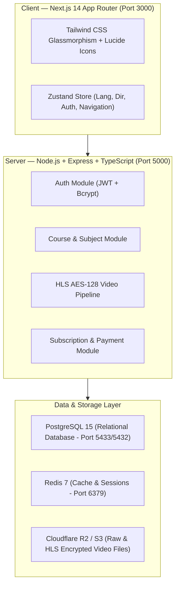

# 🎓 EduPlatform — Comprehensive Project Overview & Detailed Usage Guide

Welcome to **EduPlatform**, a paid, bilingual (Arabic/English RTL/LTR) digital educational platform designed specifically for **Egyptian secondary school students, teachers, and parents**. The platform delivers high-quality content in **Programming, Mathematics, and Physics**, aligned with the Egyptian national curriculum while serving students worldwide.

---

## 📋 Table of Contents
1. [Project Overview & Key Features](#1-project-overview--key-features)
2. [System Architecture & Technology Stack](#2-system-architecture--technology-stack)
3. [Where Data is Stored & Saved](#3-where-data-is-stored--saved)
4. [How to Set & Manage Admins](#4-how-to-set--manage-admins)
5. [Step-by-Step System Operations & Running Locally](#5-step-by-step-system-operations--running-locally)
6. [User Journeys & Features Walkthrough](#6-user-journeys--features-walkthrough)
7. [API Endpoints Summary & Testing Commands](#7-api-endpoints-summary--testing-commands)

---

## 1. Project Overview & Key Features

### Mission & Target Audience
- **Target Audience**: Egyptian secondary school students (1st, 2nd, and 3rd Secondary), their parents, and certified teachers.
- **Core Curriculum**: Secondary School **Programming** (Python, Web), **Mathematics** (Algebra, Calculus, Geometry), and **Physics** (Mechanics, Electricity, Modern Physics).
- **Language Support**: Seamless bilingual toggle between **Arabic (`ar` - RTL)** using Google Font *Tajawal* and **English (`en` - LTR)** using Google Font *Inter*.

### Key Platform Capabilities
1. **Per-Subject Subscription Model**: Flexible billing cycles (**Monthly**, **6-Month**, **Yearly**) in dual currencies (**EGP** & **USD**) per subject.
2. **Content-Based Free Preview**: The first chapter/section of every course is accessible for free (no subscription required), serving as a content trial.
3. **Self-Hosted HLS AES-128 Video Security**: Transcodes raw video into encrypted HLS segments (`.m3u8` playlist + `.ts` files). Video decryption keys are dynamically delivered via secure API endpoints ONLY to authorized subscribers or free-preview viewers.
4. **Teacher Onboarding Approval System**: Newly registered teachers default to `PENDING` status. Only approved teachers (`APPROVED`) can create courses and publish content.
5. **Parent-Student Account Linking**: Parents link child accounts via invitation codes to monitor watch time, lesson completion, and quiz scores.
6. **Bilingual Dark Mode Interface**: Built with Next.js 14 App Router, Tailwind CSS glassmorphism, and Zustand store state management.

---

## 2. System Architecture & Technology Stack



### Technology Breakdown
- **Frontend**: Next.js 14, React 18, Tailwind CSS, Lucide React, Zustand state management.
- **Backend API**: Node.js 22+, Express 5, TypeScript 5, Helmet, CORS, Morgan, JWT (`jsonwebtoken`), Bcrypt.
- **Database & ORM**: PostgreSQL 15, Redis 7, Prisma ORM v5.11.
- **Testing Tools**: Vitest, Supertest, Playwright E2E.
- **Containerization**: Docker Compose (`docker-compose.test.yml`).

---

## 3. Where Data is Stored & Saved

The platform separates data storage based on security, structure, and media requirements:

| Data Type | Storage Location / Table | Description |
| :--- | :--- | :--- |
| **User Accounts & Auth** | PostgreSQL `users` table | Stores user ID, email, hashed password (`bcrypt`), name, role (`STUDENT`, `TEACHER`, `PARENT`, `ADMIN`), active flag, and `teacherStatus` (`PENDING`, `APPROVED`, `REJECTED`). |
| **Parent-Child Link** | PostgreSQL `parent_students` table | Stores parent-student linkages (`parentId`, `studentId`) with cascading deletion. |
| **Curriculum Hierarchy** | PostgreSQL `subjects`, `courses`, `sections`, `lessons` | Stores subjects (bilingual titles `nameEn`/`nameAr`), courses, chapter sections (`isFreePreview` flag), and lessons. |
| **Pricing Plans** | PostgreSQL `subject_pricing` table | Stores subject subscription rates per period (`MONTHLY`, `SIX_MONTHS`, `YEARLY`) in `priceEgp` and `priceUsd`. |
| **Subscriptions** | PostgreSQL `subscriptions` table | Stores active user entitlements, subscription periods, start/end dates, and payment processor references (`stripeSubId`, `paypalSubId`). |
| **Video Metadata & Keys** | PostgreSQL `videos` table | Stores `videoId`, upload status (`UPLOADING`, `PROCESSING`, `READY`), storage keys (`r2StorageKey`, `hlsUrl`), and 16-byte hex encryption keys (`encryptionKey`). |
| **Raw Video Uploads** | Cloudflare R2 / S3 `uploads/raw/` | Stores raw uploaded `.mp4` video files prior to transcoding. |
| **Transcoded Video Segments** | Cloudflare R2 / S3 `hls/:videoId/` | Stores generated HLS manifest (`index.m3u8`) and AES-128 encrypted segment files (`segment_000.ts`). |
| **Key Delivery Memory** | Server RAM & API Endpoint | AES-128 decryption keys are stored as hex in DB and served as raw binary `Buffer` (`application/octet-stream`) via `/api/v1/videos/:id/key`. |
| **Client Session Tokens** | Browser `localStorage` | JWT Access Token stored under key `accessToken` for API authorization headers. |

---

## 4. How to Set & Manage Admins

Users registered through the standard signup flow receive the default role `STUDENT` (or `TEACHER` with `PENDING` approval). **Super Admin (`ADMIN`) privileges can be set using any of the 3 methods below**:

### Method A: Automated Database Seed Command (Recommended)

We have provided a built-in seeding script at `server/prisma/seed.ts`.

1. Open your terminal in `d:\digital platform\server`.
2. Run the seed command:
   ```bash
   npm run db:seed
   ```
3. **Default Admin Created**:
   - **Email**: `admin@eduplatform.com`
   - **Password**: `AdminPass123!`
   - **Role**: `ADMIN`

> [!TIP]
> You can customize the admin email and password in `server/.env` by setting `ADMIN_EMAIL` and `ADMIN_PASSWORD` before running the seed command.

---

### Method B: Prisma Studio Interactive GUI

Prisma Studio provides a clean visual database editor in your web browser:

1. Open terminal in `d:\digital platform\server`.
2. Launch Prisma Studio:
   ```bash
   npx prisma studio
   ```
3. Open your browser at `http://localhost:5555`.
4. Click on the **User** table.
5. Locate the target user row, change the **role** column value from `STUDENT` (or `TEACHER`) to `ADMIN`.
6. Click **Save 1 change** at the bottom right.

---

### Method C: Direct SQL Query via PostgreSQL Terminal / PgAdmin

If connecting directly to your PostgreSQL database (e.g. via `psql` or PgAdmin on port `5433` / `5432`):

```sql
UPDATE users
SET role = 'ADMIN'
WHERE email = 'your-email@example.com';
```

---

## 5. Step-by-Step System Operations & Running Locally

### System Prerequisites
- **Node.js**: v22.0.0 or higher
- **NPM**: v10.0.0 or higher
- **Docker Desktop**: Installed and running (for PostgreSQL & Redis containers)

---

### Step 1: Start Docker Database Containers
1. Ensure **Docker Desktop is open and running**.
2. Open terminal at `d:\digital platform\`.
3. Start PostgreSQL and Redis containers:
   ```bash
   docker compose -f docker-compose.test.yml up -d
   ```
4. Verify containers are running:
   ```bash
   docker ps
   ```

---

### Step 2: Initialize Backend Server
1. Navigate to the server folder:
   ```bash
   cd server
   ```
2. Install dependencies (if not already installed):
   ```bash
   npm install
   ```
3. Generate Prisma client & push schema to database:
   ```bash
   npx prisma generate
   npx prisma db push
   ```
4. Seed the database with default Admin:
   ```bash
   npm run db:seed
   ```
5. Run the backend development server:
   ```bash
   npm run dev
   ```
   - *Backend API will run at `http://localhost:5000/api/v1`*

---

### Step 3: Initialize Frontend Next.js Application
1. Open a new terminal at `d:\digital platform\client`.
2. Install dependencies (if not already installed):
   ```bash
   npm install
   ```
3. Start the Next.js development server:
   ```bash
   npm run dev
   ```
   - *Frontend UI will run at `http://localhost:3000`*

---

## 6. User Journeys & Features Walkthrough

### 1. Student Journey
- **Registration & Login**: Student creates an account via the Auth Modal. Received JWT access token is stored in `localStorage`.
- **Subject Browsing & Subscriptions**: Student views curriculum subjects (Programming, Math, Physics) and selects a billing cycle (Monthly, 6 Months, Yearly) in EGP or USD.
- **Free Preview Lessons**: Student can access Chapter 1 lessons of any course without an active subscription.
- **Encrypted Video Playback**: When playing a lesson video, the player fetches the `.m3u8` playlist and requests the 16-byte decryption key from `/api/v1/videos/:id/key`.

### 2. Teacher Journey
- **Registration**: Teacher signs up as a `TEACHER`. Account status starts as `PENDING`.
- **Admin Approval**: An Admin promotes or approves the teacher account.
- **Course Creation**: Approved teacher opens the Teacher Authoring Portal (`TeacherDashboard.tsx`), selects a subject, enters English and Arabic titles, and submits the course.
- **Video Uploading & HLS Transcoding**: Teacher uploads raw lesson videos (`/initiate-upload`) and triggers HLS transcoding (`/process-hls`) to encrypt video segments with AES-128.

### 3. Parent Journey
- **Registration**: Parent registers as a `PARENT`.
- **Linking Child**: Parent enters the invitation code in the Parent Monitoring Hub to link their student child's account.
- **Performance Analytics**: Parent views real-time watch time, completed quizzes, and test scores.

---

## 7. API Endpoints Summary & Testing Commands

### Running Backend Test Suite
To run all 43 automated unit and integration tests:
```bash
cd server
npx vitest run
```

### Key API Endpoints List

#### Authentication (`/api/v1/auth`)
- `POST /register` — Register new user (`STUDENT`, `TEACHER`, `PARENT`).
- `POST /login` — Login user and return JWT Access + Refresh token pair.
- `GET /me` — Get authenticated user profile.

#### Subjects & Courses (`/api/v1/subjects` & `/api/v1/courses`)
- `GET /api/v1/subjects` — List all subjects and per-period pricing plans.
- `POST /api/v1/subjects` — Admin endpoint to create new subjects.
- `GET /api/v1/courses` — Public browsing of published courses.
- `POST /api/v1/courses` — Approved Teacher endpoint to create new courses.
- `POST /api/v1/courses/:courseId/sections` — Create course chapter sections.
- `PATCH /api/v1/courses/:courseId/publish` — Publish course.

#### Video Pipeline (`/api/v1/videos`)
- `POST /initiate-upload` — Initiate video upload (Approved Teachers).
- `POST /:videoId/process-hls` — Transcode video to AES-128 HLS playlist.
- `GET /:videoId/key` — Deliver binary 16-byte AES-128 decryption key (Entitlement Guarded).
- `GET /:videoId/manifest.m3u8` — Serve HLS playlist manifest.

#### Subscriptions & Payments (`/api/v1/subscriptions`)
- `POST /checkout` — Generate Stripe or PayPal payment checkout URL.
- `POST /stripe-webhook` — Stripe webhook handler to fulfill subscriptions.
- `POST /paypal-webhook` — PayPal webhook handler.
- `GET /me` — List active user subscriptions.
- `DELETE /:id` — Cancel subscription.

---

*EduPlatform — Aligned with the Egyptian Secondary Curriculum. Built with TDD & SOLID Principles.*
