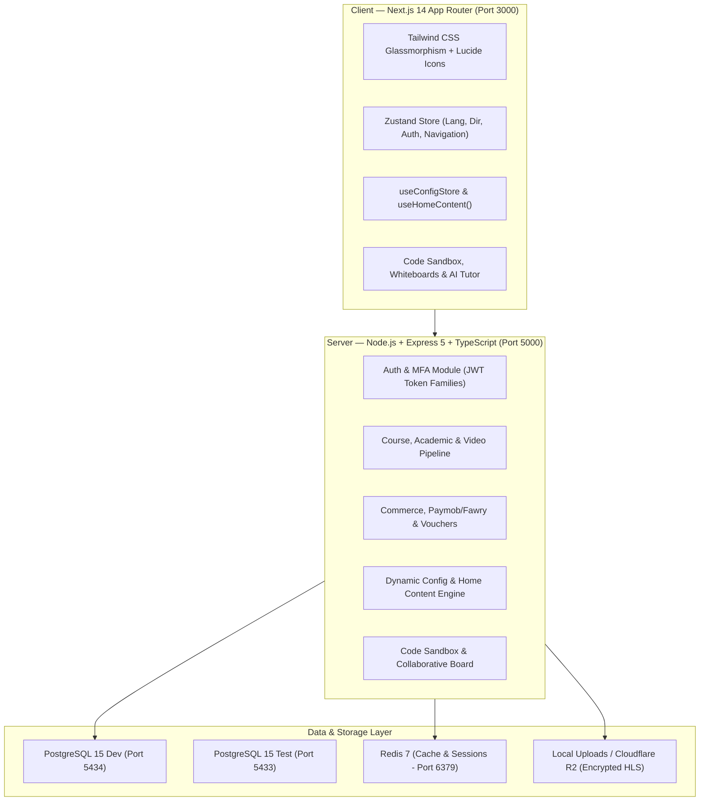

# 🎓 EduPlatform — Comprehensive Project Overview & Detailed Usage Guide

Welcome to **EduPlatform**, a paid, bilingual (Arabic/English RTL/LTR) digital educational platform designed for students, teachers, parents, and academic administrators. While seeded with curriculum for Egyptian secondary school education (Thanaweya Amma: Math, Physics, Programming), **the platform is architected to be completely generic and configurable for any subject, topic, or institution worldwide** through its real-time administrative content governance system.

---

## 📋 Table of Contents
1. [Project Overview & Key Features](#1-project-overview--key-features)
2. [System Architecture & Technology Stack](#2-system-architecture--technology-stack)
3. [Where Data is Stored & Saved](#3-where-data-is-stored--saved)
4. [How to Set & Manage Admins](#4-how-to-set--manage-admins)
5. [Step-by-Step System Operations & Running Locally](#5-step-by-step-system-operations--running-locally)
6. [User Journeys & Features Walkthrough](#6-user-journeys--features-walkthrough)
   - [6.1 Administrator Journey (Content Customization & Governance)](#61-administrator-journey)
   - [6.2 Teacher Journey (Course Authoring & Reviews)](#62-teacher-journey)
   - [6.3 Student Journey (Interactive Learning & Code Runner)](#63-student-journey)
   - [6.4 Parent Journey (Account Linking & Progress)](#64-parent-journey)
7. [API Endpoints Summary & Testing Commands](#7-api-endpoints-summary--testing-commands)

---

## 1. Project Overview & Key Features

### Mission & Target Audience
- **Target Audience**: Secondary school students, college applicants, programming learners, their parents, and certified educators.
- **Generic Domain Adaptability**: Admins can customize all words, topic tags, CTAs, and marketing copy on the landing page in both English and Arabic to adapt the platform to any discipline (e.g. Medical, Engineering, Languages, Business, IGCSE/SAT).
- **Bilingual Interface**: Seamless instant toggle between **Arabic (`ar` - RTL)** using Google Font *Tajawal* and **English (`en` - LTR)** using Google Font *Inter*.

### Key Platform Capabilities
1. **Dynamic Landing Page & Home Content Editor**:
   - Live admin customization of Hero headlines, descriptions, CTA buttons, and bottom taglines.
   - Dynamic Topic / Discipline badges (add, edit, remove specialties like Engineering, AI, Math, Physics).
   - Dynamic Trust Badges, "How It Works" 3-step cards, Teacher Recruitment callout banner, and footer audience tags.
   - Immediate live synchronization with frontend views with zero page reloads required.
2. **Interactive In-Browser Code Runner**:
   - Built-in CodeMirror Python editor with an isolated backend execution sandbox for programming lessons.
   - Enforces execution timeouts and memory limits to prevent runaway scripts.
3. **Real-Time Collaborative Whiteboards**:
   - Multiplayer drawing canvas powered by WebSockets for live geometric, mathematical, and conceptual explanations.
4. **AI Learning Assistant / Tutor Drawer**:
   - Slide-out conversational AI tutor providing contextual lesson explanations, quiz hints, and step-by-step math breakdowns.
5. **Course Review & Approval Governance**:
   - Configurable administrative gate: newly authored teacher courses can require inspection and approval in the admin queue before becoming publicly visible in the catalog.
6. **Per-Subject Subscriptions & Local Commerce**:
   - Flexible billing cycles (**Monthly**, **6-Month**, **Yearly**) in multiple currencies (**EGP**, **USD**, **SAR**).
   - Integrations for local Egyptian gateways (**Paymob**, **Fawry**, Mobile Wallets) alongside pre-paid **Voucher Code Redemption**.
7. **Self-Hosted HLS AES-128 Video Security**:
   - Transcodes raw video into encrypted HLS segments (`.m3u8` playlist + `.ts` files). Video decryption keys are dynamically delivered via secure API endpoints ONLY to authorized subscribers or free-preview viewers.
8. **Content-Based Free Preview**:
   - The first chapter/section of every course is accessible for free (no subscription required), serving as a frictionless content trial.
9. **Parent-Student Account Linking**:
   - Parents link child accounts via invitation codes to monitor watch time, lesson completion, and quiz scores.

---

## 2. System Architecture & Technology Stack


```mermaid
graph TB
    subgraph Frontend["Client — Next.js 14 App Router (Port 3000)"]
        UI["Tailwind CSS Glassmorphism + Lucide Icons"]
        Store["Zustand Store (Lang, Dir, Auth, Navigation)"]
        Config["useConfigStore & useHomeContent()"]
        Interactive["Code Sandbox, Whiteboards & AI Tutor"]
    end

    subgraph Backend["Server — Node.js + Express 5 + TypeScript (Port 5000)"]
        AuthModule["Auth & MFA Module (JWT Token Families)"]
        CourseModule["Course, Academic & Video Pipeline"]
        CommerceModule["Commerce, Paymob/Fawry & Vouchers"]
        ConfigModule["Dynamic Config & Home Content Engine"]
        ToolModules["Code Sandbox & Collaborative Board"]
    end

    subgraph Storage["Data & Storage Layer"]
        PG_Dev["PostgreSQL 15 Dev (Port 5434)"]
        PG_Test["PostgreSQL 15 Test (Port 5433)"]
        Redis["Redis 7 (Cache & Sessions - Port 6379)"]
        Media["Local Uploads / Cloudflare R2 (Encrypted HLS)"]
    end

    Frontend --> Backend
    Backend --> PG_Dev
    Backend --> Redis
    Backend --> Media
```

### Technology Breakdown
- **Frontend**: Next.js 14.2 (App Router), React 18, Tailwind CSS, Lucide React, CodeMirror, Tiptap WYSIWYG, Zustand state management.
- **Backend API**: Node.js 22, Express 5, TypeScript 5, Helmet, CORS, Morgan, JWT with rotation, Bcrypt, Zod validation.
- **Database & ORM**: PostgreSQL 15, Redis 7, Prisma ORM v5.11.
- **Testing Tools**: Vitest (338 automated backend tests), Supertest, Playwright E2E.
- **Containerization**: Docker Compose (`docker-compose.yml`).

---

## 3. Where Data is Stored & Saved

The platform separates data storage based on security, structure, and media requirements:

| Data Type | Storage Location / Table | Description |
| :--- | :--- | :--- |
| **Platform Branding & Home Content** | PostgreSQL `app_config` table | Stores bilingual site names, slogans, currency, exchange rate, feature flags, and full `homeContent` JSON payload for the landing page. |
| **User Accounts & Auth** | PostgreSQL `users` table | Stores user ID, email, hashed password (`bcrypt`), name, role (`STUDENT`, `TEACHER`, `PARENT`, `ADMIN`), active flag, and `teacherStatus`. |
| **Refresh Token Families** | PostgreSQL `refresh_tokens` table | Stores active refresh tokens with token family lineage for reuse detection and automatic revocation. |
| **Curriculum Hierarchy** | PostgreSQL `academic_stages`, `academic_grades`, `subjects`, `courses`, `sections`, `lessons` | Multi-tier curriculum hierarchy with bilingual titles, course review status (`DRAFT`, `PENDING_REVIEW`, `APPROVED`, `REJECTED`), and free-preview flags. |
| **Orders & Payments** | PostgreSQL `orders`, `payments` tables | Tracks checkout sessions, amounts, gateway providers (`PAYMOB`, `FAWRY`, `STRIPE`), and payment statuses. |
| **Vouchers & Entitlements** | PostgreSQL `vouchers`, `entitlements` tables | Pre-paid coupon redemption codes and resolved course/subject access rights. |
| **Video Metadata & Keys** | PostgreSQL `videos` table | Stores `videoId`, upload status, storage keys, and 16-byte hex encryption keys (`encryptionKey`). |
| **Interactive Tools** | PostgreSQL `collaborative_boards`, `playground_runs` | Whiteboard drawing rooms and student code execution histories. |
| **Raw & Encrypted Video Files** | Local `./uploads/` or Cloudflare R2 / S3 | Raw `.mp4` uploads and generated HLS `.m3u8` manifests with `.ts` segments. |
| **Key Delivery Memory** | Server RAM & API Endpoint | AES-128 decryption keys served as raw binary `Buffer` (`application/octet-stream`) via `/api/v1/videos/:id/key`. |
| **Client Session Tokens** | Browser `localStorage` | JWT Access Token stored for API authorization headers. |

---

## 4. How to Set & Manage Admins

Users registered through the standard signup flow receive the default role `STUDENT` (or `TEACHER` with `PENDING` approval). **Super Admin (`ADMIN`) privileges can be granted using either method below**:

### Method A: Standalone Admin Utility Script (Fastest)

Run the included admin creation script from the `server/` directory:
```bash
cd server
node create-admin.js admin@eduplatform.com P@ssword123 "System Administrator"
```
If the user already exists, the script promotes their role to `ADMIN`. If the user does not exist, it creates a new activated administrator account.

### Method B: Automated Database Seed Command

We provide a built-in seeding script at `server/prisma/seed.ts`:
```bash
cd server
npm run db:seed
```
This sets up default admin accounts (`admin@eduplatform.com` / `AdminPass123!`), approved teachers, subjects, and sample courses.

---

## 5. Step-by-Step System Operations & Running Locally

### Step 1: Start Database Containers
```bash
cd "d:\digital platform"
docker-compose up -d
```
Verify containers are running:
- Dev Database: `localhost:5434`
- Test Database: `localhost:5433`
- Redis: `localhost:6379`

### Step 2: Push Database Schema & Start Server
```bash
cd server
npm install
npx prisma db push
npm run dev
```
The server will boot on `http://localhost:5000`.

### Step 3: Start Frontend Client
```bash
cd ../client
npm install
npm run dev
```
The client application will open on `http://localhost:3000`.

---

## 6. User Journeys & Features Walkthrough

### 6.1 Administrator Journey
1. **Login**: Authenticate with an admin account. The navigation bar will display the **Admin Portal** link.
2. **Rebranding & Home Page Customization**:
   - Navigate to `/admin/dashboard` and select **Platform & Domain Configuration**.
   - Click the **Home Page Content** tab.
   - Edit the top Navbar Subtitle, Hero headings (Lines 1 & 2), Descriptions, and CTA labels in both English and Arabic.
   - Use the **Add Badge** button to introduce new topic tags (e.g. *Computer Science*, *Biomedical*, *Law*), or delete existing badges.
   - Customize the 3 "How It Works" steps, Teacher Recruitment banner, and Footer audience tags.
   - Click **Save Platform Settings**. Changes take effect across the entire website immediately without a restart!
3. **Course Approval Review Queue**:
   - Select the **Course Approvals** tab.
   - Inspect pending courses submitted by teachers. Review lesson lists, syllabus, and preview clips.
   - Click **Approve Course** to publish it to the student catalog, or **Reject** with feedback.
4. **Developer Tokens & Webhooks**:
   - Issue scoped API tokens for external integrations.
   - Register webhook URLs to receive notifications for payment events, course publishing, or new enrollments.

### 6.2 Teacher Journey
1. **Application & Verification**:
   - Teacher signs up selecting the "Teacher" role. Account starts in `PENDING` review status.
   - Once approved by an Admin, the teacher gains access to `/teacher/dashboard`.
2. **Course Authoring**:
   - Teacher creates a course under an approved subject, defines chapters, and uploads lesson videos.
   - Video upload pipeline automatically creates HLS playlists and assigns encryption keys.
   - Teacher can attach PDF materials, create quizzes with multiple-choice questions, and define assignments.
3. **Submission for Review**:
   - When course approval governance is enabled, clicking "Submit for Review" sends the course to the Admin review queue.

### 6.3 Student Journey
1. **Exploring & Previewing**:
   - Student browses courses by subject or searches for specific topics.
   - The first chapter of every course is accessible for free (no subscription required) via the Content-Based Free Preview gate.
2. **Enrollment & Subscriptions**:
   - Student subscribes via Paymob, Fawry, Mobile Wallet, or redeems an offline physical voucher code.
   - Subscription entitles the student to all premium lessons, quizzes, and attachments for the chosen period.
3. **Interactive Tools**:
   - In programming lessons, students open the **Interactive Code Runner** to write and test Python code directly in the browser.
   - In math and physics lessons, students collaborate on the **Collaborative Whiteboard** canvas.
   - Students can open the **AI Tutor Drawer** at any time to receive explanations and step-by-step guidance.

### 6.4 Parent Journey
1. **Registration & Linking**:
   - Parent registers as `PARENT`.
   - In the Parent Hub, enters the student's unique 6-character family invitation code.
2. **Progress Monitoring**:
   - Parent views real-time dashboards showing completed lessons, quiz scores, homework grades, and total learning hours.

---

## 7. API Endpoints Summary & Testing Commands

### Running Backend Automated Tests
```bash
cd server
npm test
```
Runs 338 automated unit and integration tests across 67 test files in Vitest with 100% pass rate.

### Key API Endpoints Catalog

#### Authentication & Security (`/api/v1/auth`)
- `POST /register` — Register student, teacher, or parent.
- `POST /login` — Authenticate and receive JWT access token + refresh cookie.
- `POST /refresh` — Rotate refresh token family.
- `POST /logout` — Invalidate refresh token family.
- `POST /mfa-setup` & `POST /mfa-verify` — TOTP two-factor authentication.

#### Platform Configuration (`/api/v1/config`)
- `GET /` — Public platform config (site name, slogan, currencies, and `homeContent`).
- `PUT /` — (Admin only) Update platform settings, feature flags, and **Home Page Content**.

#### Courses & Curriculum (`/api/v1/courses` & `/api/v1/academic`)
- `GET /` — Browse published courses.
- `POST /` — Create course (Teachers).
- `POST /:id/submit-for-review` — Submit course to admin review queue.
- `GET /api/v1/academic/stages` — Academic stages and grades hierarchy.

#### Interactive Learning (`/api/v1/playground` & `/api/v1/board`)
- `POST /api/v1/playground/run` — Execute Python script in sandbox.
- `GET /api/v1/board/rooms/:id` — Whiteboard room status.

#### Commerce & Billing (`/api/v1/commerce`)
- `POST /checkout` — Initiate order with Paymob / Fawry / Card.
- `POST /vouchers/redeem` — Atomically redeem pre-paid voucher code.
- `POST /webhooks/paymob` & `POST /webhooks/fawry` — Payment confirmation webhooks.

#### Admin Controls (`/api/v1/admin`)
- `GET /courses/pending` — Fetch courses awaiting review.
- `PUT /courses/:id/approve` — Approve course for publication.
- `PUT /users/:id/role` — Update user role or approve teacher.

---

*EduPlatform — Generic, Rebrandable, Enterprise E-Learning Architecture. Built with TDD, Clean Architecture, and SOLID Principles.*
